# zERC20 プライバシートークンプロトコル 監査事前提示文書

**作成日**: 2026年1月11日  

---

## 目次

1. [はじめに](#1-はじめに)
2. [プロトコル仕様](#2-プロトコル仕様)
   - [2.1 概要](#21-概要)
   - [2.2 主要な登場人物 (Entities)](#22-主要な登場人物-entities)
   - [2.3 主要なデータ構造](#23-主要なデータ構造)
3. [トラストモデル](#3-トラストモデル)
   - [3.1 信頼レベル定義](#31-信頼レベル定義)
   - [3.2 コンポーネント分類](#32-コンポーネント分類)
   - [3.3 信頼境界エッジ](#33-信頼境界エッジ)
   - [3.4 監査範囲](#34-監査範囲)
   - [3.5 重大度定義](#35-重大度定義)
4. [メインプログラムグラフ](#4-メインプログラムグラフ)
5. [サブグラフ別プロパティとチェックリスト](#5-サブグラフ別プロパティとチェックリスト)
   - [5.1 Nova IVC Proof Generation (Client-Side)](#51-nova-ivc-proof-generation-client-side)
   - [5.2 Nova to Groth16 Conversion (Decider/Prover Service)](#52-nova-to-groth16-conversion-deciderprover-service)
   - [5.3 Nova Transfer Root Proof Verification (On-Chain)](#53-nova-transfer-root-proof-verification-on-chain)
   - [5.4 Withdrawal Proof Verification (Nova or Groth16)](#54-withdrawal-proof-verification-nova-or-groth16)
   - [5.5 Incentive Curve Calculation (IncentiveLib)](#55-incentive-curve-calculation-incentivelib)
   - [5.6 Hub PoseidonT3 Aggregation Tree Computation](#56-hub-poseidont3-aggregation-tree-computation)
   - [5.7 LayerZero v2 Cross-Chain Message Flow](#57-layerzero-v2-cross-chain-message-flow)
   - [5.8 Stealth Burn Address Generation with PoW](#58-stealth-burn-address-generation-with-pow)
   - [5.9 Stargate Bridge Detailed Flow](#59-stargate-bridge-detailed-flow)
   - [5.10 LayerZero lzCompose Callback Processing](#510-layerzero-lzcompose-callback-processing)
   - [5.11 Poseidon Hash Circuit Implementation](#511-poseidon-hash-circuit-implementation)
   - [5.12 Internet Computer Canister Interactions](#512-internet-computer-canister-interactions)
   - [5.13 Nova Folding Scheme Internal Operations](#513-nova-folding-scheme-internal-operations)
   - [5.14 SelfCall Utility Pattern for Reentrancy Prevention](#514-selfcall-utility-pattern-for-reentrancy-prevention)
   - [5.15 Native Token (ETH) Processing Flow](#515-native-token-eth-processing-flow)
   - [5.16 Governance and Administrative Functions](#516-governance-and-administrative-functions)
   - [5.17 Adaptor SelfCall Protected Functions](#517-adaptor-selfcall-protected-functions)
   - [5.18 IncentiveLib Fee Parameter Validation](#518-incentivelib-fee-parameter-validation)
   - [5.19 Adaptor Withdraw Function Flow](#519-adaptor-withdraw-function-flow)
   - [5.20 LiquidityManager receive() Native Token Handling](#520-liquiditymanager-receive-native-token-handling)
   - [5.21 Adaptor _removeStargateDust Decimal Handling](#521-adaptor-_removestargateDust-decimal-handling)
   - [5.22 Adaptor lzCompose Cross-Chain Unwrap Flow](#522-adaptor-lzcompose-cross-chain-unwrap-flow)
6. [境界セキュリティチェックリスト](#6-境界セキュリティチェックリスト)
   - [6.1 ユーザー入力検証](#61-ユーザー入力検証)
   - [6.2 ZKP検証](#62-zkp検証)
   - [6.3 クロスチェーンメッセージング](#63-クロスチェーンメッセージング)
   - [6.4 LayerZero lzComposeコールバック](#64-layerzero-lzcomposeコールバック)
7. [プロパティカテゴリ別サマリ](#7-プロパティカテゴリ別サマリ)
8. [結論とフィードバック依頼](#8-結論とフィードバック依頼)
9. [付録](#付録)
   - [付録A: トラストモデル一覧表](#付録a-トラストモデル一覧表)
   - [付録B: プロパティ一覧表](#付録b-プロパティ一覧表)
   - [付録C: チェックリスト一覧表](#付録c-チェックリスト一覧表)

---

## 1. はじめに

本文書は、**zERC20プライバシートークンプロトコル**のセキュリティ監査を開始するにあたり、監査対象となるシステムの仕様、信頼モデル（トラストモデル）、および監査の焦点となるプロパティとチェックリストを事前提示し、関係者間の認識を統一することを目的とします。

---

## 2. プロトコル仕様

### 2.1 概要

| 項目 | 内容 |
|:---|:---|
| **プロトコル名** | zERC20 Privacy Token Protocol |
| **キーワード** | zkSNARKs, zkWormhole, zERC20 |

> 本プロトコルは、Nova folding schemesとGroth16証明を使用してプライベートなERC20転送を実現するマルチチェーンプライバシートークンプロトコルです。LayerZero v2を介したクロスチェーン連携により、複数のEVMチェーン間でのプライバシー保護された資産移動を可能にします。

### 2.2 主要な登場人物 (Entities)

本プロトコルには16のエンティティが定義されています。

| ID | エンティティ名 | 説明 |
|:---|:---|:---|
| `ACTOR-USER` | End User | CLI/dAppを介してwrap、unwrap、transfer、private teleportを実行する外部ユーザー |
| `ACTOR-ZERC20-CONTRACT` | zERC20 Token Contract | BN254スカラーフィールド互換性のためvalue <= 2^248-1を強制するアップグレード可能なERC-20実装。SHA-256ハッシュチェーンで転送履歴を維持 |
| `ACTOR-VERIFIER-CONTRACT` | Verifier Contract | Nova/Groth16証明検証とクロスチェーン連携を管理するLayerZero OApp |
| `ACTOR-HUB-CONTRACT` | Hub Contract | トークンごとの転送ルートと単調増加ツリーインデックスを追跡する中央集約ポイント |
| `ACTOR-LIQUIDITY-MANAGER` | LiquidityManager Contract | zERC20のmint/burnの唯一の権限。インセンティブカーブによるwrap報酬とunwrap手数料を実装 |
| `ACTOR-ADAPTOR-CONTRACT` | Adaptor Contract | Stargateブリッジを使用したクロスチェーン出口調整。LayerZero経由のlzComposeコールバックを実装 |
| `ACTOR-FEE-MANAGER` | Fee Manager | ACTOR-LIQUIDITY-MANAGERに対してDATA-INCENTIVE-CURVE-PARAMSを設定できる権利を有するTRUSTED actor。FEE_MANAGER_ROLEを保持し、各chainごとの目標流動性 T = 全流動性/チェーン数 を定期的に更新する義務を負う |
| `ACTOR-CONTRACT-OWNER` | Contract Owner/Protocol Admin | onlyOwnerアクセスを持つ特権EOAまたはマルチシグ。タイムロックなしで即時効果 |
| `ACTOR-INDEXER-SERVICE` | Indexer Service | zERC20転送イベントをインデックス化し、Merkle証明を生成するオフチェーンサービス |
| `ACTOR-DECIDER-PROVER-SERVICE` | Decider/Prover Service | Nova IVC証明をGroth16最終証明に変換するオフチェーンサービス |
| `ACTOR-LAYERZERO-NETWORK` | LayerZero v2 Network | HubとVerifierコントラクト間の信頼性の高いメッセージパッシングを可能にするクロスチェーンメッセージングプロトコル |
| `ACTOR-STARGATE-BRIDGE` | Stargate Bridge | 双方向資産転送を可能にするクロスチェーン流動性ブリッジ |
| `ACTOR-IC-KEY-MANAGER` | IC Key Manager Canister | ステルスアドレスシークレットを管理するInternet Computerキャニスター |
| `ACTOR-IC-STORAGE` | IC Storage Canister | 暗号化された状態ストレージを提供するInternet Computerキャニスター |
| `ACTOR-POSEIDON-CIRCUIT` | Poseidon Hash Circuit | circom互換設定のlight-poseidonライブラリを使用したZKフレンドリーハッシュ関数 |
| `ACTOR-NOVA-CIRCUIT` | Nova Folding Circuit | sonobe/folding-schemesライブラリを使用した増分検証可能計算回路 |

### 2.3 主要なデータ構造

本プロトコルには33のデータ構造が定義されています。以下に主要なものを示します。

| ID | データ構造名 | 説明 |
|:---|:---|:---|
| `DATA-ZERC20-TOKEN` | zERC20 Token | BN254フィールド互換性のためvalue <= 2^248-1に制約されたプライバシー対応ERC20トークン |
| `DATA-HASH-CHAIN` | SHA-256 Hash Chain | 各転送で(to, value)を追加する248ビット切り捨てSHA-256ハッシュチェーン |
| `DATA-INDEXED-TRANSFER-EVENT` | IndexedTransfer Event | index、from、to、valueを含む各転送で発行されるイベント |
| `DATA-TRANSFER-ROOT` | Transfer Root | 指定インデックスでのインデックス付き転送のMerkleルート |
| `DATA-GLOBAL-TRANSFER-ROOT` | Global Transfer Root | チェーン間のすべての登録トークンの転送ルートを組み合わせたHub集約ルート |
| `DATA-AGGREGATION-ROOT` | PoseidonT3 Aggregation Root | 最大64のトークン転送ルートを集約する高さ6のPoseidonツリーのルート |
| `DATA-NOVA-IVC-PROOF` | Nova IVC Proof | Nova folding schemeで生成された増分検証可能計算証明 |
| `DATA-GROTH16-PROOF` | Groth16 Final Proof | Nova IVC証明から生成された簡潔なzkSNARK証明 |
| `DATA-GENERAL-RECIPIENT` | GeneralRecipient | chain_id、address、tweakとバージョンバイトを含むエンコードされた受信者構造 |
| `DATA-STEALTH-ADDRESS` | Stealth Burn Address | compute_burn_address_from_secret()を使用して計算された派生アドレス |
| `DATA-HISTORICAL-PROOF` | Historical Merkle Proof | target_index、leaf_index、root、hash_chain、siblings[]を含む証明構造 |
| `DATA-INCENTIVE-CURVE-PARAMS` | Incentive Curve Parameters | 線形密度曲線パラメータ: k（ベーシスポイント強度）、T（目標流動性） |
| `DATA-TELEPORT-REQUEST` | Teleport Request | zkSNARK証明を含むプライバシー保護転送リクエスト |
| `DATA-RESERVED-HASH-CHAIN` | Reserved Hash Chain Checkpoint | 予約時のzERC20状態のスナップショット |
| `DATA-LAYERZERO-MESSAGE` | LayerZero Cross-Chain Message | Hub-Verifier通信用のメッセージ構造 |

#### その他のデータ構造（18件）

| ID | データ構造名 | 説明 |
|:---|:---|:---|
| `DATA-WRAP-REQUEST` | Wrap Request | 基盤トークンをzERC20に変換するリクエスト。amount、recipientを含む |
| `DATA-UNWRAP-REQUEST` | Unwrap Request | zERC20を基盤トークンに変換するリクエスト。amount、recipientを含む |
| `DATA-TOKEN-INFO` | Token Registration Info | Hub登録トークン情報。chain EID、token address、verifier address、capacity limitsを含む |
| `DATA-BRIDGE-PARAMS` | Stargate Bridge Parameters | Adaptor経由のクロスチェーンブリッジパラメータ。destination chain、slippage limits、refund addressを含む |
| `DATA-SECRET-AND-TWEAK` | SecretAndTweak Structure | バーンアドレス生成用の暗号値。secret（PoW調整済み）、tweak（keccak256派生）を含む |
| `DATA-FULL-BURN-ADDRESS` | Full Burn Address | 完全なステルスバーンアドレス構造。GeneralRecipient、secretを含む（合計105バイト） |
| `DATA-POW-NONCE` | Proof-of-Work Nonce | find_pow_nonce()で発見されたノンス値。有効なバーンアドレスシークレットを生成する |
| `DATA-POSEIDON-STATE` | Poseidon Sponge State | Poseidonハッシュ関数の内部状態。rate-1スポンジ構造を使用 |
| `DATA-FR-SCALAR` | BN254 Scalar Field Element (Fr) | ZK回路計算に使用されるBN254スカラーフィールド要素（254ビット） |
| `DATA-IVC-STATE` | Nova IVC State Vector | Nova IVC状態ベクトル: [merkle_root, recipient, total_value, delta] |
| `DATA-EXTERNAL-INPUTS` | Withdraw External Inputs | Nova withdraw回路のステップごと外部入力: is_dummy, from_address, value, secret, leaf_index, siblings[] |
| `DATA-BRIDGE-REQUEST` | Adaptor Bridge Request | Stargateブリッジリクエスト構造: dstEid, to, minAmountOut, extraOptions, composeMsg, oftCmd |
| `DATA-OFT-RECEIPT` | OFT Receipt | Stargateクロスチェーン転送後のレシート。amountSentLD、amountReceivedLDを含む |
| `DATA-COMPOSE-MESSAGE` | LayerZero Compose Message | lzComposeコールバックで受信する生メッセージ。_from、_guid、_message、_executor、_extraDataを含む |
| `DATA-OFT-COMPOSE-MESSAGE` | OFT Compose Message | Stargate OFT転送からのデコードされたcomposeメッセージ。amountLD、composeMsgを含む |
| `DATA-FEE-QUOTE` | Adaptor Fee Quote | Adaptorの手数料内訳: tokenUnwrapFee, nativeBridgeFee, tokenBridgeFee |
| `DATA-VETKEY-DERIVED-SECRET` | VetKey Derived Secret | IC VetKeyインフラからの派生シークレット。vetKd_derive_keyキャニスター呼び出しを使用 |
| `DATA-ENCRYPTED-STATE` | IC Encrypted State | IC Storageキャニスターに保存されるAES-GCM暗号化ユーザー状態 |
| `DATA-MINTABLE-BURNABLE-INTERFACE` | IMintableBurnableERC20 Interface | mint(address to, uint256 amount)とburn(address from, uint256 amount)を公開するERC20トークンの最小インターフェース。LiquidityManagerがzERC20と対話するために使用 |
| `DATA-ADAPTOR-USER-BALANCES` | Adaptor User Balance Mappings | Adaptor内部バランス追跡: zerc20Balances[user], nativeBalances[user], underlingTokenBalances[user]。クロスチェーン操作中および失敗したcompose処理時のユーザー保留残高を追跡 |
| `DATA-INCENTIVE-FEE-PARAMS` | IncentiveLib Fee Parameters | 検証済み手数料カーブパラメータ: k（ベーシスポイント強度、K_BPS_DENOM以下）、T（目標流動性、0より大きくMAX_TARGET_LIQUIDITY以下）。LiquidityManagerストレージに保存され_validateFeeParamsで検証 |

---

## 3. トラストモデル

### 3.1 信頼レベル定義

| 信頼レベル | 説明 |
|:---|:---|
| **TRUSTED** | 完全に信頼。侵害は監査範囲外。正しく動作すると仮定 |
| **IN_SCOPE** | 監査対象。実装の正当性を検証する必要がある。コントラクト間呼び出しはここに該当 |
| **SEMI_TRUSTED** | 部分的に信頼。検証/確認が必要だが、悪意があるとは仮定しない。外部依存関係 |
| **UNTRUSTED** | 信頼しない。潜在的に悪意があると仮定。すべての入力を検証する必要がある |

### 3.2 コンポーネント分類

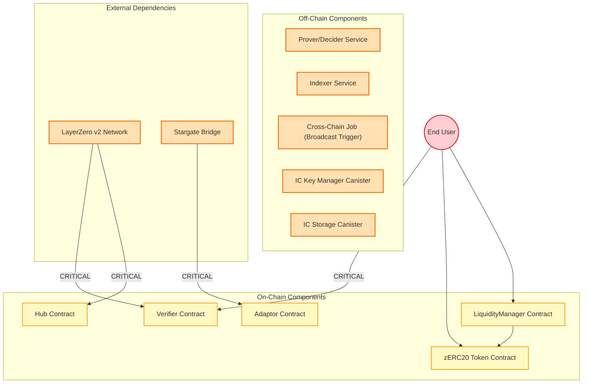
*図1: zERC20プロトコルのトラストバウンダリ概要*

#### オンチェーンコンポーネント（IN_SCOPE）

| コンポーネント | 説明 | 主要なロール |
|:---|:---|:---|
| **Verifier Contract** | Nova/Groth16証明検証とクロスチェーン連携を管理 | CALLER_USER: UNTRUSTED, CALLER_LAYERZERO: SEMI_TRUSTED |
| **zERC20 Token Contract** | value制約とハッシュチェーン整合性を持つコアトークンコントラクト | CALLER_USER: UNTRUSTED, CALLER_LIQUIDITY_MANAGER: IN_SCOPE |
| **LiquidityManager Contract** | インセンティブカーブ強制によるmint/burnの唯一の権限 | CALLER_USER: UNTRUSTED |
| **Hub Contract** | PoseidonT3ツリー計算とLayerZeroメッセージ処理を持つ中央集約ポイント | CALLER_LAYERZERO: SEMI_TRUSTED, CALLER_USER: UNTRUSTED |
| **Adaptor Contract** | スリッページ保護を持つクロスチェーン出口調整 | CALLER_USER: UNTRUSTED, CALLER_STARGATE: SEMI_TRUSTED |

#### オフチェーンコンポーネント（SEMI_TRUSTED）

| コンポーネント | 説明 | セキュリティノート |
|:---|:---|:---|
| **Prover/Decider Service** | Nova IVC証明をGroth16証明に変換 | ZKP soundnessにより、証明のシリアライゼーションやマレアビリティはセキュリティ上の懸念ではない |
| **Indexer Service** | インデックス化されたオンチェーンイベントからMerkle証明を提供 | 提供されたデータは最終的にオンチェーンで検証される |
| **Cross-Chain Job** | Verifier状態を監視しブロードキャストをトリガー | isUpToDateはオンチェーンで参照すべきではない |
| **IC Key Manager Canister** | ステルスアドレスシークレットを管理 | Internet Computerインフラ運用 |
| **IC Storage Canister** | 暗号化された状態ストレージを提供 | Internet Computerインフラ運用 |

#### 外部依存関係（SEMI_TRUSTED）

| 依存関係 | 説明 | 検証要件 |
|:---|:---|:---|
| **LayerZero v2 Network** | 13/19ガーディアンスーパーマジョリティを持つ外部クロスチェーンメッセージングインフラ | ソースEIDを登録ピアリストに対して検証する必要がある |
| **Stargate Bridge** | 外部クロスチェーン流動性ブリッジ | minAmountOutスリッページ制限を強制する必要がある |

### 3.3 信頼境界エッジ

#### 信頼境界の定義

本ドキュメントでは、**信頼境界エッジ**を以下のように定義します：

- **狭義の信頼境界**: UNTRUSTED ↔ TRUSTED/IN_SCOPE 間の境界。検証が**必須**
- **広義の信頼境界**: 異なる信頼レベル間（SEMI_TRUSTED ↔ IN_SCOPE を含む）の境界。検証が**推奨**

本プロトコルでは広義の定義を採用し、SEMI_TRUSTED → IN_SCOPE の境界も信頼境界エッジとして扱います。ただし、LayerZero/Stargateを完全にTRUSTEDと仮定する場合、これらの境界での明示的な検証は厳密には必須ではなく、多層防御（defense-in-depth）として推奨されます。

> **注記**: setPeer設定によりLayerZeroレベルで既に送信元検証が行われるため、_lzReceive内でのソースEID検証は多層防御として推奨されますが、厳密には必須ではありません。

本プロトコルには20の信頼境界エッジが定義されています。以下に**クリティカル**なものを示します。

| エッジID | 説明 | 検証要件 | クリティカル |
|:---|:---|:---|:---:|
| `EDGE-USER-SUBMITS-TELEPORT` | 信頼されないユーザーがGroth16証明を含むテレポートリクエストをVerifierに送信 | Groth16証明を完全に検証、転送ルートの存在を確認、受信者バインディングを検証、単調増加totalTeleportedを強制 | **Yes** |
| `EDGE-LAYERZERO-TO-HUB` | LayerZeroがクロスチェーンメッセージをHubに配信 | ペイロードを受け入れる前に、ソースEIDを登録Verifierリストに対して検証 | **Yes** |
| `EDGE-LAYERZERO-TO-VERIFIER` | LayerZeroがHubからVerifierにグローバルルートを配信 | グローバルルートを保存する前に、ソースEIDが認可されたHubであることを検証（推奨：setPeerにより既に送信元検証済みのため厳密には必須ではない） | **Yes** |
| `EDGE-LAYERZERO-TO-ADAPTOR` | LayerZeroエンドポイントがクロスチェーンOFT転送完了後にAdaptorでlzComposeコールバックを呼び出し | msg.senderがLayerZeroエンドポイントであることを検証。_fromが登録されたzerc20アドレスであることを確認。デコードエラー時はrevertせずイベント発行+returnで資産ロックを防止（LayerZeroをTRUSTEDと仮定する場合、厳密には信頼境界ではないが多層防御として検証推奨） | **Yes** |
| `EDGE-VERIFIER-TO-ZERC20-TELEPORT` | VerifierがZKP検証成功後にzERC20でteleportを呼び出してトークンをmint | zERC20.teleport()はmsg.sender == verifier()を検証する必要がある。これはLiquidityManagerとは別の特権mintingパスウェイ | **Yes** |

#### クリティカル境界サマリ

| 境界タイプ | 説明 | 検証原則 |
|:---|:---|:---|
| **USER_TO_CONTRACT** | プロトコルコントラクトとのすべてのユーザーインタラクション | すべてのユーザー入力は、状態変更前に暗号学的に検証またはバウンドチェックされる必要がある |
| **CROSS_CHAIN_MESSAGING** | HubとVerifierコントラクト間のLayerZeroメッセージパッシング | ソースエンドポイントID（EID）は、メッセージペイロードを受け入れる前に登録ピアリストに対して検証される必要がある |
| **OFF_CHAIN_OUTPUT** | オンチェーンで使用されるオフチェーンサービスからのデータ | すべてのオフチェーンデータはオンチェーンで暗号学的に検証される（ZK証明、Merkle証明） |
| **INTER_CONTRACT** | 両方のmintingパスウェイを含むプロトコルコントラクト間の呼び出し | 呼び出し元認可を検証する必要がある。両方のパスウェイがzERC20をmintできる - 二重カウントやバイパスがないことを確認 |
| **OWNER_PRIVILEGED** | 信頼されたオーナーによる管理操作 | オーナー侵害は範囲外。タイムロックなし（設計上の意図：タイムロックはSafe wallet等のowner walletの責務であり、コントラクト個別の責務ではない） |
| **EXTERNAL_BRIDGE** | Stargate/LayerZeroを介した双方向クロスチェーン資産ブリッジング | アウトバウンド: スリッページ制限が保護。インバウンド (lzCompose via LayerZero): msg.senderがLayerZeroエンドポイントであること、_fromが登録zerc20であることを検証、デコードエラー時はrevertせずイベント+returnで資産ロック防止 |

### 3.4 監査範囲

#### 監査対象（In Scope）

> **注記**: **Solidityコントラクトのみ**が監査対象です。

**コアコントラクト:**
- Hub.sol
- zERC20.sol
- Verifier.sol

**流動性管理:**
- liquidity/LiquidityManager.sol
- liquidity/Adaptor.sol

**ユーティリティ:**
- utils/SelfCall.sol
- utils/GeneralRecipientLib.sol
- utils/PoseidonAggregationConfig.sol
- utils/PoseidonAggregationLib.sol
- utils/ShaHashChainLib.sol

**ライブラリ:**
- libraries/IncentiveLib.sol

**検証器:**
- verifiers/RootNovaDecider.sol
- verifiers/WithdrawGlobalNovaDecider.sol
- verifiers/WithdrawGlobalGroth16Verifier.sol
- verifiers/WithdrawLocalNovaDecider.sol
- verifiers/WithdrawLocalGroth16Verifier.sol

**インターフェース:**
- interfaces/IzERC20.sol
- interfaces/IStargate.sol
- interfaces/ILiquidityManager.sol
- interfaces/IVerifier.sol
- interfaces/IDecider.sol
- interfaces/IMintableBurnableERC20.sol

#### 監査対象外（Out of Scope）

| 項目 | 説明 |
|:---|:---|
| **DEPLOYMENT_AND_OWNER_PRIVILEGES** | デプロイ時パラメータの操作またはコントラクトオーナー権限を必要とする脆弱性。オーナー権限はTRUSTED actor |
| **TRUSTED_SETUP** | 回路のtrusted setupに関連する攻撃。現在の実装は開発/テスト用に固定シードを使用 |
| **VOLUME_BASED_DOS** | 大量の転送を発行することのみで達成されるDoS |
| **SELF_INFLICTED_ATTACKS** | 攻撃者自身のみに影響するバグ |
| **RECOVERABLE_CROSS_CHAIN_GRIEFING** | 不十分なガスによる意図的に失敗するクロスチェーンメッセージの送信 |
| **Nova to Groth16 Conversion** | オフチェーン処理 |
| **Stealth Burn Address Generation** | オフチェーン処理 |
| **Poseidon Hash Circuit Implementation** | ZKP回路実装 |
| **Internet Computer Canister Interactions** | オフチェーン処理 |
| **Nova Folding Scheme Internal Operations** | ZKP内部処理 |
| **Timelock/Multisig Implementation** | Safe walletの責務。オーナー権限はTRUSTED actor |
| **89-bit burn address collision** | 別監査済み、既知問題（下記参照） |

#### 既知の問題（Known Issues）

| ID | 説明 | ステータス |
|:---|:---|:---|
| **KNOWN-001** | ZKPはbn254を使用しているため100bit以下のセキュリティ。burn addressの衝突耐性のため89bitまで低下 | ACCEPTED |

> **注記**: 89bitのburn address衝突耐性は別途監査済みであり、スコープ外として扱います。

#### 監査対象外の例外

| 項目 | 発見時の重大度 |
|:---|:---|
| **EXPENSIVE_RETRY_CROSS_CHAIN_ATTACK** | リトライコストが直接実行コストを超えるクロスチェーンメッセージング攻撃 | HIGH |
| **IRRECOVERABLE_CROSS_CHAIN_STATE** | リトライ不可能または回復不可能な状態を作成するクロスチェーンメッセージング攻撃 | CRITICAL |

### 3.5 重大度定義

| レベル | 説明 | 例 |
|:---|:---|:---|
| **CRITICAL** | ZKP soundnessの欠如；資産盗難、永久的な資産ロック、またはシステム障害につながる可能性 | ZKP回路soundness脆弱性、totalTeleportedバイパスによる二重支出、無限トークンインフレーションにつながる不正mint |
| **HIGH** | 機密性侵害；システムを停止できる低コストで実行しやすい攻撃；一時的な資産ロック | ユーザートランザクションリンク可能性を露出するプライバシーリーク、低コストでクロスチェーンメッセージングを停止するDoS攻撃 |
| **MEDIUM** | 特定の前提条件または限定的なシナリオでのみ悪用可能；90ビット以下の有効セキュリティレベル | 特定のコントラクト状態またはタイミングを必要とする攻撃、90ビット以下のセキュリティを持つ暗号学的弱点 |
| **LOW** | 安全性への直接的な影響は少ないが、運用上の誤用を誘発、将来の複合障害の種をまく、または可用性/コストを低下させる可能性 | 経済的グリーフィングを可能にするガス非効率、オフチェーン監視を妨げる欠落イベント発行 |
| **INFORMATIONAL** | ZKP/コントラクトベストプラクティスからの逸脱または軽微な設計上の欠点；リスクは間接的 | コードスタイルの不一致、欠落NatSpecドキュメント、冗長なストレージ読み取り |

---

## 4. メインプログラムグラフ

メインプログラムグラフ（`GRAPH-ZERC20-MAIN`）は、zERC20プロトコルの主要なフローを表現しています。

```mermaid
flowchart TD
    classDef userNode fill:#e8f5e9,stroke:#2e7d32,stroke-width:2px
    classDef lmNode fill:#fff3e0,stroke:#f57c00,stroke-width:2px
    classDef zerc20Node fill:#e3f2fd,stroke:#1976d2,stroke-width:2px
    classDef verifierNode fill:#fce4ec,stroke:#c2185b,stroke-width:2px
    classDef hubNode fill:#f3e5f5,stroke:#7b1fa2,stroke-width:2px
    classDef offchainNode fill:#efebe9,stroke:#5d4037,stroke-width:2px
    classDef adaptorNode fill:#e0f2f1,stroke:#00796b,stroke-width:2px
    classDef errorNode fill:#ffcdd2,stroke:#c62828,stroke-width:2px

    subgraph User["User Actions"]
        STATE_USER_IDLE["User Idle"]
        STATE_USER_HAS_UNDERLYING["User Holds Underlying"]
        STATE_USER_HAS_ZERC20["User Holds zERC20"]
        STATE_USER_HAS_NOVA_PROOF["User Has Nova IVC Proof"]
        STATE_USER_HAS_GROTH16_PROOF["User Has Groth16 Proof"]
        ACTION_USER_GENERATE_STEALTH[["Generate Stealth Burn Address"]]
        ACTION_USER_GENERATE_NOVA_PROOF[["Generate Nova IVC Proof [CLI]"]]
        ACTION_USER_SUBMIT_TO_PROVER[["Submit IVC to Prover Service"]]
        ACTION_USER_SUBMIT_TELEPORT[["Submit Teleport to Verifier"]]
    end

    subgraph LiquidityManager["LiquidityManager"]
        STATE_LM_AWAITING_WRAP["Awaiting Wrap Request"]
        ACTION_LM_CALCULATE_REWARD[["Calculate Wrap Reward"]]
        ACTION_LM_PULL_LIQUIDITY[["Pull Underlying from User"]]
        ACTION_LM_MINT_ZERC20[["Mint zERC20 [amount + reward]"]]
        STATE_WRAP_COMPLETE["Wrap Complete"]
        STATE_LM_AWAITING_UNWRAP["Awaiting Unwrap Request"]
        ACTION_LM_CALCULATE_FEE[["Calculate Unwrap Fee"]]
        ACTION_LM_BURN_ZERC20[["Burn zERC20"]]
        ACTION_LM_TRANSFER_UNDERLYING[["Transfer Underlying [amount - fee]"]]
        STATE_UNWRAP_COMPLETE["Unwrap Complete"]
        STATE_UNWRAP_HIGH_FEE["Low Liquidity - High Fee Applied"]
    end

    subgraph zERC20["zERC20 Token"]
        STATE_ZERC20_AWAITING_TRANSFER["Awaiting Transfer"]
        ACTION_ZERC20_VALIDATE_VALUE[["Validate value <= 2^248-1"]]
        ACTION_ZERC20_UPDATE_BALANCES[["Update Balances"]]
        ACTION_ZERC20_UPDATE_HASH_CHAIN[["Update SHA-256 Hash Chain"]]
        ACTION_ZERC20_EMIT_INDEXED_TRANSFER[["Emit IndexedTransfer"]]
        STATE_TRANSFER_COMPLETE["Transfer Complete"]
        STATE_TRANSFER_REJECTED(("Value Too Large"))
    end

    subgraph Verifier["Verifier Contract"]
        STATE_VERIFIER_IDLE["Verifier Idle"]
        ACTION_VERIFIER_RESERVE_HASH_CHAIN[["Reserve Hash Chain Checkpoint"]]
        STATE_HASH_CHAIN_RESERVED["Checkpoint Reserved"]
        STATE_AWAITING_ROOT_PROOF["Awaiting Transfer Root Proof"]
        ACTION_VERIFIER_VALIDATE_NOVA[["Validate Nova Proof"]]
        STATE_TRANSFER_ROOT_PROVED["Transfer Root Proved"]
        STATE_EMERGENCY(("Emergency - Divergent Proofs"))
        ACTION_VERIFIER_RELAY_ROOT[["Relay Root to Hub via LZ"]]
        STATE_ROOT_RELAYED["Root Relayed"]
        STATE_AWAITING_TELEPORT["Awaiting Teleport Proof"]
        ACTION_VERIFIER_VALIDATE_ROOT_REF[["Validate Root Reference"]]
        ACTION_VERIFIER_VALIDATE_RECIPIENT[["Validate Recipient Hash"]]
        ACTION_VERIFIER_CHECK_MONOTONICITY[["Check totalTeleported Monotonicity"]]
        ACTION_VERIFIER_VALIDATE_WITHDRAWAL[["Validate Withdrawal Proof"]]
        ACTION_VERIFIER_CALL_TELEPORT[["Call zERC20.teleport[]"]]
        STATE_TELEPORT_COMPLETE["Teleport Complete"]
        STATE_TELEPORT_REJECTED(("Teleport Rejected"))
        ACTION_VERIFIER_SAVE_GLOBAL_ROOT[["Save Global Root"]]
        STATE_GLOBAL_ROOT_SAVED["Global Root Available"]
    end

    subgraph Hub["Hub Contract"]
        STATE_HUB_IDLE["Hub Idle"]
        ACTION_HUB_RECEIVE_ROOT[["Receive Root via _lzReceive"]]
        ACTION_HUB_UPDATE_ROOT[["Update transferRoots"]]
        STATE_ROOT_UPDATED["Root Updated"]
        STATE_AWAITING_BROADCAST["Awaiting Broadcast"]
        ACTION_HUB_COMPUTE_AGG[["Compute PoseidonT3 Aggregation"]]
        ACTION_HUB_INCREMENT_SEQ[["Increment aggSeq"]]
        ACTION_HUB_BROADCAST[["Broadcast to Verifiers via LZ"]]
        STATE_GLOBAL_ROOT_BROADCAST["Global Root Broadcast"]
    end

    subgraph OffChain["Off-Chain Services"]
        STATE_INDEXER_IDLE["Indexer Idle"]
        ACTION_INDEXER_WATCH[["Watch IndexedTransfer Events"]]
        ACTION_INDEXER_BUILD_TREE[["Build Merkle Tree"]]
        STATE_INDEXER_READY["Merkle Tree Ready"]
        ACTION_INDEXER_GENERATE_PROOFS[["Generate Historical Proofs"]]
        STATE_PROVER_IDLE["Prover Service Idle"]
        ACTION_PROVER_RECEIVE[["Receive Nova IVC"]]
        STATE_JOB_QUEUED["Job Queued"]
        STATE_JOB_PROCESSING["Job Processing"]
        ACTION_PROVER_CONVERT[["Convert to Groth16"]]
        STATE_JOB_COMPLETED["Groth16 Ready"]
        STATE_JOB_FAILED(("Conversion Failed"))
    end

    subgraph Adaptor["Adaptor Contract"]
        STATE_ADAPTOR_IDLE["Adaptor Idle"]
        ACTION_ADAPTOR_RECEIVE[["Receive unwrapAndBridge - Local"]]
        ACTION_ADAPTOR_UNWRAP[["Unwrap via LiquidityManager"]]
        ACTION_ADAPTOR_BRIDGE[["Bridge via Stargate"]]
        STATE_BRIDGE_INITIATED["Bridge Initiated"]
        STATE_BRIDGE_FAILED(("Bridge Failed"))
        ACTION_ADAPTOR_LZCOMPOSE[["lzCompose Callback - Cross-Chain"]]
        ACTION_ADAPTOR_VALIDATE_SENDER[["Validate msg.sender is LZ Endpoint"]]
        ACTION_ADAPTOR_VALIDATE_FROM[["Validate _from is registered zERC20"]]
        ACTION_ADAPTOR_DECODE_REQUEST[["Decode BridgeRequest"]]
        STATE_ADAPTOR_DECODE_FAILED(("Decode Failed - Emit Event"))
        ACTION_ADAPTOR_UNWRAP_RECEIVED[["Unwrap Received zERC20"]]
        ACTION_ADAPTOR_BRIDGE_BACK[["Bridge Underlying to Origin Chain"]]
        STATE_CROSS_CHAIN_COMPLETE["Cross-Chain Unwrap Complete"]
    end

    subgraph CrossChainFlow["Cross-Chain zERC20 Bridge Flow - Chain A to B"]
        STATE_USER_CHAIN_A["User on Chain A with zERC20"]
        ACTION_SEND_OFT[["zERC20.send() with lzCompose option to Chain B Adaptor"]]
        STATE_OFT_IN_TRANSIT["OFT Transfer In Transit"]
        ACTION_LZ_DELIVER[["LayerZero Delivers to Chain B"]]
    end

    %% Wrap Flow
    STATE_USER_HAS_UNDERLYING -->|"wrap()"| STATE_LM_AWAITING_WRAP
    STATE_LM_AWAITING_WRAP --> ACTION_LM_CALCULATE_REWARD
    ACTION_LM_CALCULATE_REWARD --> ACTION_LM_PULL_LIQUIDITY
    ACTION_LM_PULL_LIQUIDITY --> ACTION_LM_MINT_ZERC20
    ACTION_LM_MINT_ZERC20 --> STATE_WRAP_COMPLETE
    STATE_WRAP_COMPLETE --> STATE_USER_HAS_ZERC20

    %% Unwrap Flow
    STATE_USER_HAS_ZERC20 -->|"unwrap()"| STATE_LM_AWAITING_UNWRAP
    STATE_LM_AWAITING_UNWRAP --> ACTION_LM_CALCULATE_FEE
    ACTION_LM_CALCULATE_FEE --> ACTION_LM_BURN_ZERC20
    ACTION_LM_CALCULATE_FEE -->|Low liquidity| STATE_UNWRAP_HIGH_FEE
    STATE_UNWRAP_HIGH_FEE --> ACTION_LM_BURN_ZERC20
    ACTION_LM_BURN_ZERC20 --> ACTION_LM_TRANSFER_UNDERLYING
    ACTION_LM_TRANSFER_UNDERLYING --> STATE_UNWRAP_COMPLETE
    STATE_UNWRAP_COMPLETE --> STATE_USER_HAS_UNDERLYING

    %% Transfer Flow
    STATE_USER_HAS_ZERC20 -->|"transfer()"| STATE_ZERC20_AWAITING_TRANSFER
    STATE_ZERC20_AWAITING_TRANSFER --> ACTION_ZERC20_VALIDATE_VALUE
    ACTION_ZERC20_VALIDATE_VALUE -->|Valid| ACTION_ZERC20_UPDATE_BALANCES
    ACTION_ZERC20_VALIDATE_VALUE -->|Too large| STATE_TRANSFER_REJECTED
    ACTION_ZERC20_UPDATE_BALANCES --> ACTION_ZERC20_UPDATE_HASH_CHAIN
    ACTION_ZERC20_UPDATE_HASH_CHAIN --> ACTION_ZERC20_EMIT_INDEXED_TRANSFER
    ACTION_ZERC20_EMIT_INDEXED_TRANSFER --> STATE_TRANSFER_COMPLETE

    %% Indexer Flow
    STATE_INDEXER_IDLE --> ACTION_INDEXER_WATCH
    ACTION_INDEXER_WATCH --> ACTION_INDEXER_BUILD_TREE
    ACTION_INDEXER_BUILD_TREE --> STATE_INDEXER_READY
    STATE_INDEXER_READY --> ACTION_INDEXER_GENERATE_PROOFS

    %% Verifier Transfer Root Proof Flow
    STATE_VERIFIER_IDLE -->|"reserveHashChain()"| ACTION_VERIFIER_RESERVE_HASH_CHAIN
    ACTION_VERIFIER_RESERVE_HASH_CHAIN --> STATE_HASH_CHAIN_RESERVED
    STATE_HASH_CHAIN_RESERVED --> STATE_AWAITING_ROOT_PROOF
    STATE_AWAITING_ROOT_PROOF -->|"proveTransferRoot()"| ACTION_VERIFIER_VALIDATE_NOVA
    ACTION_VERIFIER_VALIDATE_NOVA -->|Valid| STATE_TRANSFER_ROOT_PROVED
    ACTION_VERIFIER_VALIDATE_NOVA -->|Divergent| STATE_EMERGENCY
    STATE_TRANSFER_ROOT_PROVED --> ACTION_VERIFIER_RELAY_ROOT
    ACTION_VERIFIER_RELAY_ROOT --> STATE_ROOT_RELAYED

    %% Hub Aggregation Flow
    STATE_ROOT_RELAYED --> ACTION_HUB_RECEIVE_ROOT
    ACTION_HUB_RECEIVE_ROOT --> ACTION_HUB_UPDATE_ROOT
    ACTION_HUB_UPDATE_ROOT --> STATE_ROOT_UPDATED
    STATE_ROOT_UPDATED --> STATE_AWAITING_BROADCAST
    STATE_AWAITING_BROADCAST -->|"broadcast()"| ACTION_HUB_COMPUTE_AGG
    ACTION_HUB_COMPUTE_AGG --> ACTION_HUB_INCREMENT_SEQ
    ACTION_HUB_INCREMENT_SEQ --> ACTION_HUB_BROADCAST
    ACTION_HUB_BROADCAST --> STATE_GLOBAL_ROOT_BROADCAST
    STATE_GLOBAL_ROOT_BROADCAST --> ACTION_VERIFIER_SAVE_GLOBAL_ROOT
    ACTION_VERIFIER_SAVE_GLOBAL_ROOT --> STATE_GLOBAL_ROOT_SAVED

    %% Private Teleport Flow
    STATE_USER_IDLE --> ACTION_USER_GENERATE_STEALTH
    ACTION_USER_GENERATE_STEALTH --> ACTION_USER_GENERATE_NOVA_PROOF
    ACTION_USER_GENERATE_NOVA_PROOF --> STATE_USER_HAS_NOVA_PROOF
    STATE_USER_HAS_NOVA_PROOF --> ACTION_USER_SUBMIT_TO_PROVER
    ACTION_USER_SUBMIT_TO_PROVER --> ACTION_PROVER_RECEIVE
    ACTION_PROVER_RECEIVE --> STATE_JOB_QUEUED
    STATE_JOB_QUEUED --> STATE_JOB_PROCESSING
    STATE_JOB_PROCESSING --> ACTION_PROVER_CONVERT
    ACTION_PROVER_CONVERT -->|Success| STATE_JOB_COMPLETED
    ACTION_PROVER_CONVERT -->|Fail| STATE_JOB_FAILED
    STATE_JOB_COMPLETED --> STATE_USER_HAS_GROTH16_PROOF
    STATE_USER_HAS_GROTH16_PROOF --> ACTION_USER_SUBMIT_TELEPORT

    %% Teleport Verification Flow
    ACTION_USER_SUBMIT_TELEPORT --> STATE_AWAITING_TELEPORT
    STATE_AWAITING_TELEPORT --> ACTION_VERIFIER_VALIDATE_ROOT_REF
    ACTION_VERIFIER_VALIDATE_ROOT_REF -->|Valid| ACTION_VERIFIER_VALIDATE_RECIPIENT
    ACTION_VERIFIER_VALIDATE_ROOT_REF -->|Invalid| STATE_TELEPORT_REJECTED
    ACTION_VERIFIER_VALIDATE_RECIPIENT -->|Valid| ACTION_VERIFIER_CHECK_MONOTONICITY
    ACTION_VERIFIER_VALIDATE_RECIPIENT -->|Mismatch| STATE_TELEPORT_REJECTED
    ACTION_VERIFIER_CHECK_MONOTONICITY -->|Valid| ACTION_VERIFIER_VALIDATE_WITHDRAWAL
    ACTION_VERIFIER_CHECK_MONOTONICITY -->|Double-spend| STATE_TELEPORT_REJECTED
    ACTION_VERIFIER_VALIDATE_WITHDRAWAL -->|Valid| ACTION_VERIFIER_CALL_TELEPORT
    ACTION_VERIFIER_VALIDATE_WITHDRAWAL -->|Invalid proof| STATE_TELEPORT_REJECTED
    ACTION_VERIFIER_CALL_TELEPORT --> STATE_TELEPORT_COMPLETE

    %% Local Bridge Flow - Same Chain
    STATE_USER_HAS_ZERC20 -->|"unwrapAndBridge()"| ACTION_ADAPTOR_RECEIVE
    ACTION_ADAPTOR_RECEIVE --> ACTION_ADAPTOR_UNWRAP
    ACTION_ADAPTOR_UNWRAP --> ACTION_ADAPTOR_BRIDGE
    ACTION_ADAPTOR_BRIDGE -->|Success| STATE_BRIDGE_INITIATED
    ACTION_ADAPTOR_BRIDGE -->|Fail| STATE_BRIDGE_FAILED

    %% Cross-Chain Bridge Flow - lzCompose
    %% User on Chain A wants to unwrap using Chain B liquidity
    STATE_USER_CHAIN_A -->|"zERC20.send() with lzCompose option"| ACTION_SEND_OFT
    ACTION_SEND_OFT --> STATE_OFT_IN_TRANSIT
    STATE_OFT_IN_TRANSIT --> ACTION_LZ_DELIVER
    ACTION_LZ_DELIVER -->|"lzCompose callback on Chain B"| ACTION_ADAPTOR_LZCOMPOSE
    ACTION_ADAPTOR_LZCOMPOSE --> ACTION_ADAPTOR_VALIDATE_SENDER
    ACTION_ADAPTOR_VALIDATE_SENDER -->|Valid| ACTION_ADAPTOR_VALIDATE_FROM
    ACTION_ADAPTOR_VALIDATE_FROM -->|Valid| ACTION_ADAPTOR_DECODE_REQUEST
    ACTION_ADAPTOR_DECODE_REQUEST -->|Success| ACTION_ADAPTOR_UNWRAP_RECEIVED
    ACTION_ADAPTOR_DECODE_REQUEST -->|Fail| STATE_ADAPTOR_DECODE_FAILED
    ACTION_ADAPTOR_UNWRAP_RECEIVED --> ACTION_ADAPTOR_BRIDGE_BACK
    ACTION_ADAPTOR_BRIDGE_BACK -->|"Stargate to Chain A"| STATE_CROSS_CHAIN_COMPLETE

    %% Styling
    class STATE_USER_IDLE,STATE_USER_HAS_UNDERLYING,STATE_USER_HAS_ZERC20,STATE_USER_HAS_NOVA_PROOF,STATE_USER_HAS_GROTH16_PROOF userNode
    class ACTION_USER_GENERATE_STEALTH,ACTION_USER_GENERATE_NOVA_PROOF,ACTION_USER_SUBMIT_TO_PROVER,ACTION_USER_SUBMIT_TELEPORT userNode
    class STATE_LM_AWAITING_WRAP,ACTION_LM_CALCULATE_REWARD,ACTION_LM_PULL_LIQUIDITY,ACTION_LM_MINT_ZERC20,STATE_WRAP_COMPLETE lmNode
    class STATE_LM_AWAITING_UNWRAP,ACTION_LM_CALCULATE_FEE,ACTION_LM_BURN_ZERC20,ACTION_LM_TRANSFER_UNDERLYING,STATE_UNWRAP_COMPLETE lmNode
    class STATE_ZERC20_AWAITING_TRANSFER,ACTION_ZERC20_VALIDATE_VALUE,ACTION_ZERC20_UPDATE_BALANCES,ACTION_ZERC20_UPDATE_HASH_CHAIN,ACTION_ZERC20_EMIT_INDEXED_TRANSFER,STATE_TRANSFER_COMPLETE zerc20Node
    class STATE_VERIFIER_IDLE,ACTION_VERIFIER_RESERVE_HASH_CHAIN,STATE_HASH_CHAIN_RESERVED,STATE_AWAITING_ROOT_PROOF,ACTION_VERIFIER_VALIDATE_NOVA verifierNode
    class STATE_TRANSFER_ROOT_PROVED,ACTION_VERIFIER_RELAY_ROOT,STATE_ROOT_RELAYED,STATE_AWAITING_TELEPORT verifierNode
    class ACTION_VERIFIER_VALIDATE_ROOT_REF,ACTION_VERIFIER_VALIDATE_RECIPIENT,ACTION_VERIFIER_CHECK_MONOTONICITY,ACTION_VERIFIER_VALIDATE_WITHDRAWAL verifierNode
    class ACTION_VERIFIER_CALL_TELEPORT,STATE_TELEPORT_COMPLETE,ACTION_VERIFIER_SAVE_GLOBAL_ROOT,STATE_GLOBAL_ROOT_SAVED verifierNode
    class STATE_HUB_IDLE,ACTION_HUB_RECEIVE_ROOT,ACTION_HUB_UPDATE_ROOT,STATE_ROOT_UPDATED,STATE_AWAITING_BROADCAST hubNode
    class ACTION_HUB_COMPUTE_AGG,ACTION_HUB_INCREMENT_SEQ,ACTION_HUB_BROADCAST,STATE_GLOBAL_ROOT_BROADCAST hubNode
    class STATE_INDEXER_IDLE,ACTION_INDEXER_WATCH,ACTION_INDEXER_BUILD_TREE,STATE_INDEXER_READY,ACTION_INDEXER_GENERATE_PROOFS offchainNode
    class STATE_PROVER_IDLE,ACTION_PROVER_RECEIVE,STATE_JOB_QUEUED,STATE_JOB_PROCESSING,ACTION_PROVER_CONVERT,STATE_JOB_COMPLETED offchainNode
    class STATE_ADAPTOR_IDLE,ACTION_ADAPTOR_RECEIVE,ACTION_ADAPTOR_UNWRAP,ACTION_ADAPTOR_BRIDGE,STATE_BRIDGE_INITIATED adaptorNode
    class ACTION_ADAPTOR_LZCOMPOSE,ACTION_ADAPTOR_VALIDATE_SENDER,ACTION_ADAPTOR_VALIDATE_FROM,ACTION_ADAPTOR_DECODE_REQUEST adaptorNode
    class ACTION_ADAPTOR_UNWRAP_RECEIVED,ACTION_ADAPTOR_BRIDGE_BACK,STATE_CROSS_CHAIN_COMPLETE adaptorNode
    class STATE_USER_CHAIN_A,ACTION_SEND_OFT,STATE_OFT_IN_TRANSIT,ACTION_LZ_DELIVER userNode
    class STATE_UNWRAP_HIGH_FEE lmNode
    class STATE_TRANSFER_REJECTED,STATE_EMERGENCY,STATE_TELEPORT_REJECTED,STATE_JOB_FAILED,STATE_BRIDGE_FAILED,STATE_ADAPTOR_DECODE_FAILED errorNode
```
*図: zERC20 Privacy Token Protocol - Main Flow*

| 項目 | 値 |
|:---|:---|
| **グラフID** | GRAPH-ZERC20-MAIN |
| **タイトル** | zERC20 Privacy Token Protocol - Main Flow |
| **ノード数** | 81 |
| **エッジ数** | 95 |

メイングラフは以下の主要なフローを含みます：

1. **Wrap Flow**: ユーザーが基礎トークンをzERC20にラップ
2. **Unwrap Flow**: ユーザーがzERC20を基礎トークンにアンラップ
3. **Transfer Flow**: zERC20の標準転送とハッシュチェーン更新
4. **Teleport Flow**: ZKP検証を伴うプライバシー保護転送
5. **Cross-Chain Flow**: LayerZeroを介したHub-Verifier間の通信
6. **Local Bridge Flow**: 同一チェーンでのStargateブリッジ
7. **Cross-Chain Bridge Flow (lzCompose)**: Chain AのzERC20をChain Bの流動性でunwrapし、Stargateで送り返すフロー
   - ユーザーがChain Aでzerc20のOFT send()メソッドにlzComposeオプションを付けて実行し、Chain BのAdaptorに送信
   - LayerZeroがChain BでlzComposeコールバックを呼び出し
   - AdaptorがzERC20を受け取り、LiquidityManagerでunderlying tokenにunwrap
   - underlying tokenをStargateでChain Aに送り返す

---

## 5. サブグラフ別プロパティとチェックリスト

本プロトコルには17のサブグラフが定義されています。各サブグラフに対して、関連するプロパティとチェックリストを以下に示します。

### 5.1 Nova IVC Proof Generation (Client-Side)

| 項目 | 値 |
|:---|:---|
| **グラフID** | GRAPH-NOVA-PROOF-GENERATION |
| **ノード数** | 8 |
| **エッジ数** | 8 |

クライアントサイドでのNova IVC証明生成フローを表現します。ユーザーがIndexerからMerkle証明を取得し、Nova folding stepを実行して最終的なIVC証明を生成します。

### 5.2 Nova to Groth16 Conversion (Decider/Prover Service)

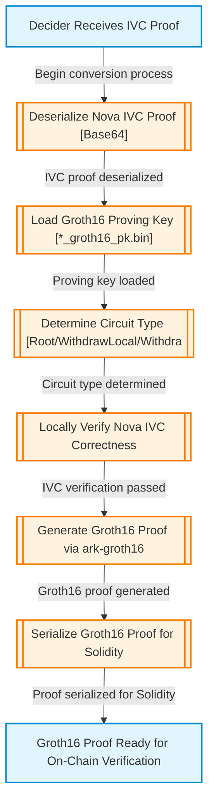
*図2: Nova to Groth16 Conversion フロー*

| 項目 | 値 |
|:---|:---|
| **グラフID** | GRAPH-NOVA-TO-GROTH16 |
| **ノード数** | 8 |
| **エッジ数** | 7 |

Decider/Prover ServiceがNova IVC証明をGroth16証明に変換するフローを表現します。

### 5.3 Nova Transfer Root Proof Verification (On-Chain)

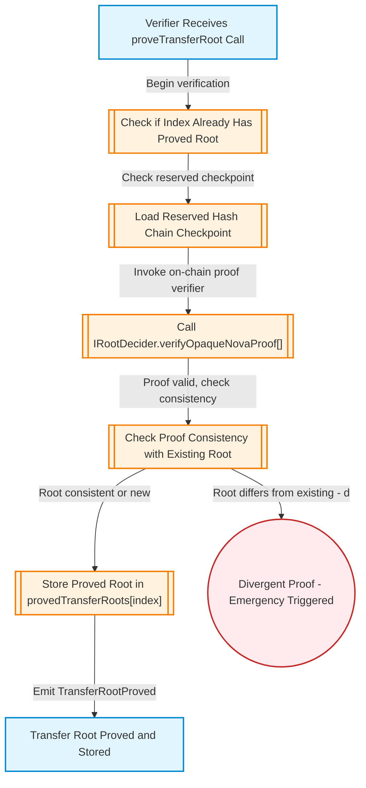
*図3: Nova Transfer Root Proof Verification フロー*

| 項目 | 値 |
|:---|:---|
| **グラフID** | GRAPH-NOVA-PROOF-VERIFICATION |
| **ノード数** | 8 |
| **エッジ数** | 7 |

オンチェーンでの転送ルート証明検証フローを表現します。

#### 関連プロパティ

| ID | プロパティ | カテゴリ |
|:---|:---|:---|
| `PROP-NODE-VERIFY-ROOT-INIT` | Verifierがprove TransferRoot呼び出しを受信した時点で、証明データの整合性チェックが開始される | STATE_INVARIANT |
| `PROP-NODE-VERIFY-CALL-ROOT-DECIDER` | IRootDecider.verifyOpaqueNovaProof()の呼び出しは、証明が数学的に正しい場合にのみtrueを返す | SOUNDNESS |
| `PROP-NODE-VERIFY-CHECK-PROOF-CONSISTENCY` | 同じインデックスに対して異なるルートが証明された場合、緊急状態がトリガーされる | INTEGRITY |

### 5.4 Withdrawal Proof Verification (Nova or Groth16)

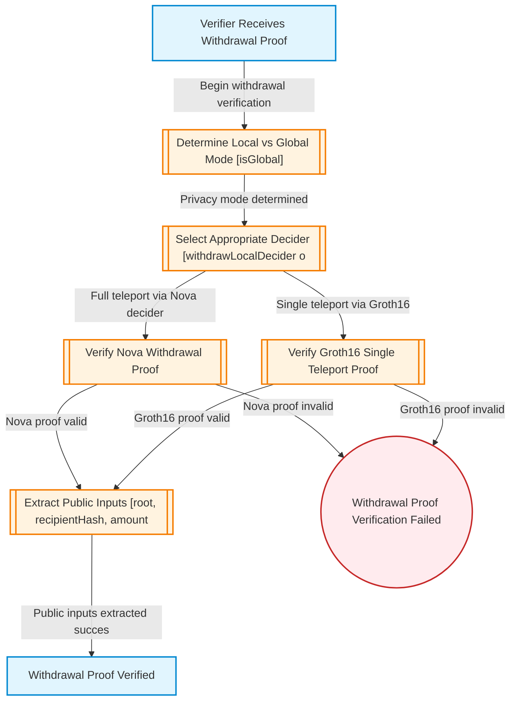
*図4: Withdrawal Proof Verification フロー*

| 項目 | 値 |
|:---|:---|
| **グラフID** | GRAPH-WITHDRAWAL-PROOF-VERIFICATION |
| **ノード数** | 8 |
| **エッジ数** | 9 |

引き出し証明（NovaまたはGroth16）の検証フローを表現します。

#### 関連プロパティ

| ID | プロパティ | カテゴリ |
|:---|:---|:---|
| `PROP-WITHDRAWAL-SOUNDNESS` | 有効な引き出し証明なしにトークンをmintすることは不可能 | SOUNDNESS |
| `PROP-WITHDRAWAL-MONOTONICITY` | totalTeleportedは厳密に増加し、減少することはない | MONOTONICITY |
| `PROP-WITHDRAWAL-RECIPIENT-BINDING` | 証明内の受信者ハッシュは、実際のmint受信者にバインドされている | INTEGRITY |

### 5.5 Incentive Curve Calculation (IncentiveLib)

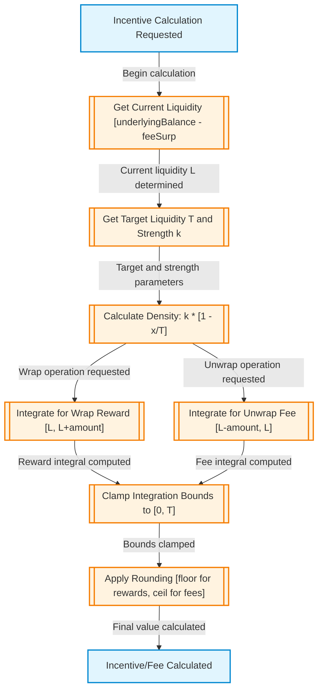
*図5: Incentive Curve Calculation フロー*

| 項目 | 値 |
|:---|:---|
| **グラフID** | GRAPH-INCENTIVE-CURVE |
| **ノード数** | 9 |
| **エッジ数** | 9 |

IncentiveLibによるインセンティブカーブ計算フローを表現します。

#### 関連プロパティ

| ID | プロパティ | カテゴリ |
|:---|:---|:---|
| `PROP-INCENTIVE-FLOOR-REWARD` | 報酬計算はfloor divisionを使用し、プロトコルが過払いしないことを保証 | INTEGRITY |
| `PROP-INCENTIVE-CEILING-FEE` | 手数料計算はceiling divisionを使用し、プロトコルが手数料を過少収集しないことを保証 | INTEGRITY |
| `PROP-INCENTIVE-BOUNDS` | 計算された報酬/手数料は常に[0, amount]の範囲内 | STATE_INVARIANT |

### 5.6 Hub PoseidonT3 Aggregation Tree Computation

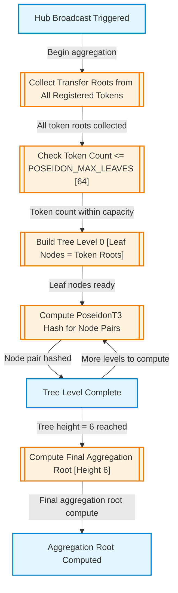
*図6: Hub PoseidonT3 Aggregation Tree Computation フロー*

| 項目 | 値 |
|:---|:---|
| **グラフID** | GRAPH-HUB-AGGREGATION |
| **ノード数** | 8 |
| **エッジ数** | 8 |

HubでのPoseidonT3集約ツリー計算フローを表現します。

#### 関連プロパティ

| ID | プロパティ | カテゴリ |
|:---|:---|:---|
| `PROP-HUB-AGGREGATION-DETERMINISM` | 同じ入力に対して、集約ルート計算は常に同じ結果を生成 | INTEGRITY |
| `PROP-HUB-AGGSEQ-MONOTONICITY` | aggSeqカウンターは厳密に増加し、リセットされない | MONOTONICITY |

### 5.7 LayerZero v2 Cross-Chain Message Flow

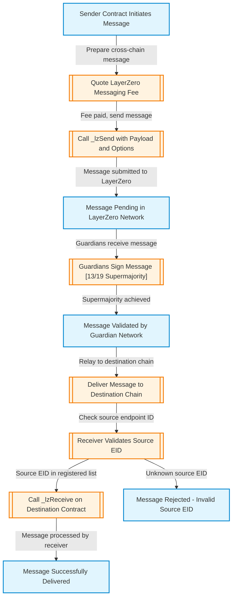
*図7: LayerZero v2 Cross-Chain Message Flow*

| 項目 | 値 |
|:---|:---|
| **グラフID** | GRAPH-LAYERZERO-MESSAGE-FLOW |
| **ノード数** | 11 |
| **エッジ数** | 10 |

LayerZero v2を介したクロスチェーンメッセージフローを表現します。

#### 関連プロパティ

| ID | プロパティ | カテゴリ |
|:---|:---|:---|
| `PROP-LZ-PEER-VALIDATION` | _lzReceiveは、ソースEIDが登録ピアリストにない場合、メッセージを拒否する | BOUNDARY_SECURITY |
| `PROP-LZ-MESSAGE-INTEGRITY` | LayerZeroメッセージのペイロードは、送信から受信まで改ざんされない | INTEGRITY |

### 5.8 Stealth Burn Address Generation with PoW

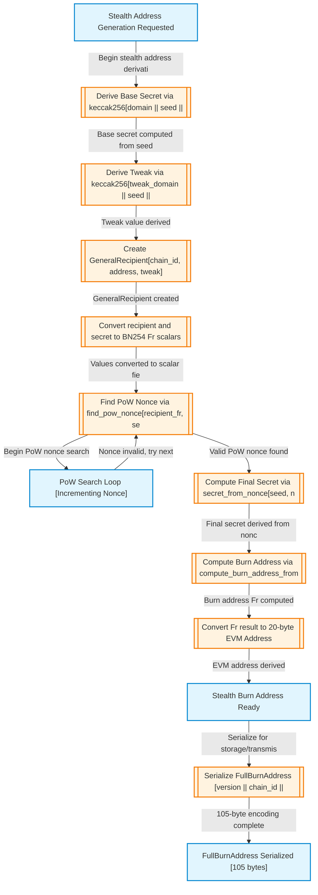
*図8: Stealth Burn Address Generation with PoW フロー*

| 項目 | 値 |
|:---|:---|
| **グラフID** | GRAPH-STEALTH-ADDRESS-GENERATION |
| **ノード数** | 13 |
| **エッジ数** | 13 |

Proof-of-Workを伴うステルスバーンアドレス生成フローを表現します。

#### 関連プロパティ

| ID | プロパティ | カテゴリ |
|:---|:---|:---|
| `PROP-STEALTH-POW-VALIDITY` | PoW検証は、有効なnonceを持つアドレスのみを受け入れる | SOUNDNESS |
| `PROP-STEALTH-ADDRESS-DERIVATION` | ステルスアドレスは、シークレットから決定論的に派生する | INTEGRITY |

### 5.9 Stargate Bridge Detailed Flow

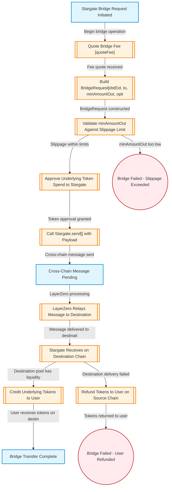
*図9: Stargate Bridge Detailed Flow*

| 項目 | 値 |
|:---|:---|
| **グラフID** | GRAPH-STARGATE-BRIDGE-FLOW |
| **ノード数** | 14 |
| **エッジ数** | 13 |

Stargateブリッジの詳細フローを表現します。

#### 関連プロパティ

| ID | プロパティ | カテゴリ |
|:---|:---|:---|
| `PROP-STARGATE-SLIPPAGE-PROTECTION` | minAmountOutスリッページ制限が強制され、ユーザーは予想より少ない額を受け取らない | INTEGRITY |
| `PROP-STARGATE-REFUND-HANDLING` | スリッページ超過時、リファンドアドレスに正しく返金される | INTEGRITY |

### 5.10 LayerZero lzCompose Callback Processing

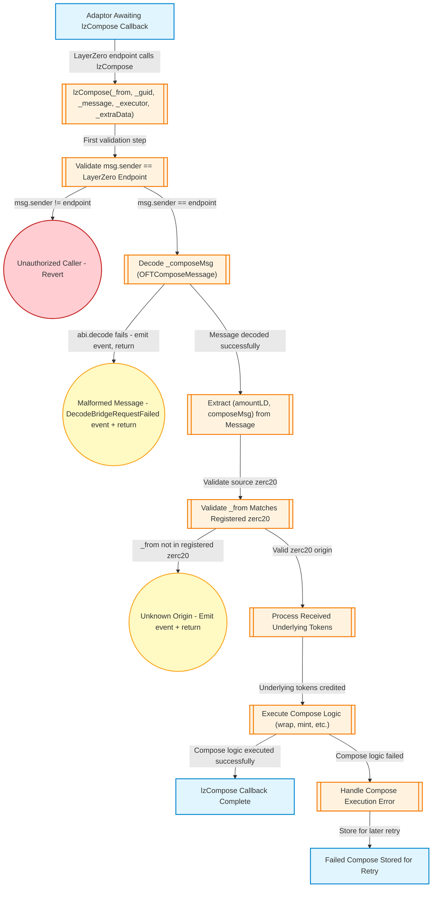
*図9: LayerZero lzCompose Callback Processing フロー*

| 項目 | 値 |
|:---|:---|
| **グラフID** | GRAPH-LAYERZERO-LZCOMPOSE-CALLBACK |
| **ノード数** | 14 |
| **エッジ数** | 13 |

LayerZeroエンドポイントからのlzComposeコールバック処理フローを表現します。

> **重要**: lzComposeでデコードエラーが発生した場合、revertしてはなりません。revertすると資産がスタックしてしまうため、DecodeBridgeRequestFailedイベントを発行してreturnする必要があります。

> **注記**: リエントランシーが可能であったとしても、具体的な攻撃が存在しない限りは問題なしとします。

#### 関連プロパティ

| ID | プロパティ | カテゴリ |
|:---|:---|:---|
| `PROP-LZCOMPOSE-SENDER-VALIDATION` | lzComposeは、msg.senderがLayerZeroエンドポイントであり、_fromが登録されたzerc20アドレスであることを検証 | BOUNDARY_SECURITY |
| `PROP-LZCOMPOSE-NO-REVERT-ON-DECODE` | lzComposeはデコードエラー時にrevertせず、イベント発行+returnで資産ロックを防止 | BOUNDARY_SECURITY |

### 5.11 Poseidon Hash Circuit Implementation

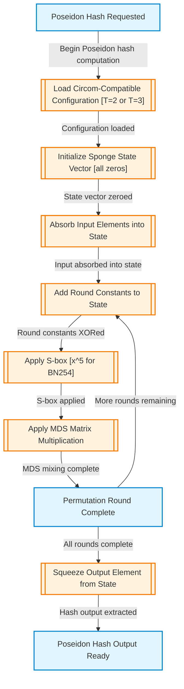
*図10: Poseidon Hash Circuit Implementation フロー*

| 項目 | 値 |
|:---|:---|
| **グラフID** | GRAPH-POSEIDON-HASH-CIRCUIT |
| **ノード数** | 9 |
| **エッジ数** | 10 |

Poseidonハッシュ関数のZK回路実装フローを表現します。light-poseidonライブラリを使用し、circom互換の設定（PoseidonT2およびPoseidonT3）でハッシュ計算を行います。

#### 関連プロパティ

| ID | プロパティ | カテゴリ |
|:---|:---|:---|
| `PROP-POSEIDON-CIRCOM-COMPATIBILITY` | PoseidonハッシュパラメータはcircomとRust実装間で一致する | INTEGRITY |
| `PROP-POSEIDON-SPONGE-SECURITY` | Poseidonスポンジ構造は暗号学的セキュリティを維持する | SOUNDNESS |

### 5.12 Internet Computer Canister Interactions

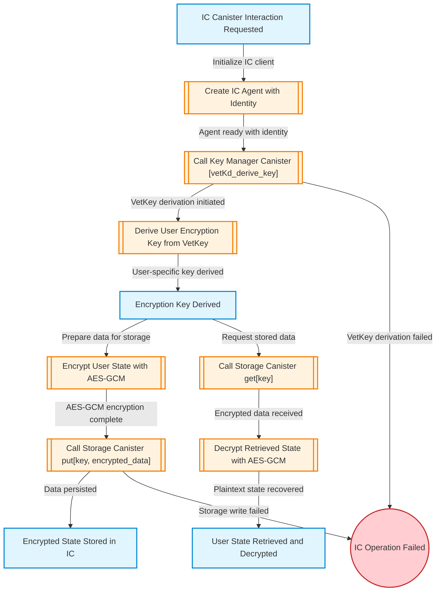
*図12: Internet Computer Canister Interactions フロー*

| 項目 | 値 |
|:---|:---|
| **グラフID** | GRAPH-IC-CANISTER-INTERACTION |
| **ノード数** | 12 |
| **エッジ数** | 12 |

Internet Computer（IC）キャニスターとのインタラクションフローを表現します。VetKeyを使用した暗号鍵導出、AES-GCMによる状態暗号化、ICストレージキャニスターでの永続化を含みます。

#### 関連プロパティ

| ID | プロパティ | カテゴリ |
|:---|:---|:---|
| `PROP-IC-VETKEY-DERIVATION` | VetKeyから導出された暗号鍵はユーザー固有である | DATA_PROTECTION |
| `PROP-IC-STORAGE-ENCRYPTION` | ICストレージに保存されるすべての状態はAES-GCMで暗号化される | DATA_PROTECTION |

### 5.13 Nova Folding Scheme Internal Operations

```mermaid
flowchart TD
    classDef stateNode fill:#e1f5fe,stroke:#0288d1,stroke-width:2px
    classDef actionNode fill:#fff3e0,stroke:#f57c00,stroke-width:2px
    classDef errorNode fill:#ffcdd2,stroke:#c62828,stroke-width:2px

    STATE_NOVA_FOLD_INIT["Nova Folding Scheme Initialized"]
    ACTION_NOVA_LOAD_PP[["Load Public Parameters [pp, vp]"]]
    ACTION_NOVA_INIT_ACCUMULATOR[["Initialize Relaxed R1CS Accumulator"]]
    ACTION_NOVA_SET_INITIAL_STATE[["Set Initial State Vector z_0"]]
    STATE_NOVA_READY_FOR_STEP["Nova Ready for Folding Step"]
    ACTION_NOVA_RECEIVE_EXTERNAL_INPUT[["Receive External Inputs"]]
    ACTION_NOVA_COMPUTE_STEP_CIRCUIT[["Execute Step Circuit F[z_i, w_i]"]]
    ACTION_NOVA_VERIFY_MERKLE_PATH[["Verify Merkle Path Against Root"]]
    ACTION_NOVA_UPDATE_ACCUMULATORS[["Update Running Instance"]]
    ACTION_NOVA_COMPUTE_RANDOM_T[["Compute Cross-Term T and Challenge r"]]
    ACTION_NOVA_FOLD_INSTANCES[["Fold Instances into Running Accumulator"]]
    STATE_NOVA_STEP_COMPLETE["Folding Step Complete"]
    ACTION_NOVA_FINALIZE_IVC_PROOF[["Finalize IVC Proof"]]
    ACTION_NOVA_VERIFY_IVC[["Verify IVC Proof Locally"]]
    STATE_NOVA_IVC_VALID["IVC Proof Valid and Complete"]
    STATE_NOVA_VERIFICATION_FAILED(("IVC Verification Failed"))

    STATE_NOVA_FOLD_INIT -->|Initialize Nova scheme| ACTION_NOVA_LOAD_PP
    ACTION_NOVA_LOAD_PP -->|Parameters loaded| ACTION_NOVA_INIT_ACCUMULATOR
    ACTION_NOVA_INIT_ACCUMULATOR -->|Accumulator created| ACTION_NOVA_SET_INITIAL_STATE
    ACTION_NOVA_SET_INITIAL_STATE -->|Initial state configured| STATE_NOVA_READY_FOR_STEP
    STATE_NOVA_READY_FOR_STEP -->|Begin folding step| ACTION_NOVA_RECEIVE_EXTERNAL_INPUT
    ACTION_NOVA_RECEIVE_EXTERNAL_INPUT -->|Inputs received| ACTION_NOVA_COMPUTE_STEP_CIRCUIT
    ACTION_NOVA_COMPUTE_STEP_CIRCUIT -->|Step function executed| ACTION_NOVA_VERIFY_MERKLE_PATH
    ACTION_NOVA_VERIFY_MERKLE_PATH -->|Merkle path valid| ACTION_NOVA_UPDATE_ACCUMULATORS
    ACTION_NOVA_UPDATE_ACCUMULATORS -->|Accumulator updated| ACTION_NOVA_COMPUTE_RANDOM_T
    ACTION_NOVA_COMPUTE_RANDOM_T -->|Cross-term ready| ACTION_NOVA_FOLD_INSTANCES
    ACTION_NOVA_FOLD_INSTANCES -->|Instances folded| STATE_NOVA_STEP_COMPLETE
    STATE_NOVA_STEP_COMPLETE -->|More transfers to fold| STATE_NOVA_READY_FOR_STEP
    STATE_NOVA_STEP_COMPLETE -->|All transfers folded| ACTION_NOVA_FINALIZE_IVC_PROOF
    ACTION_NOVA_FINALIZE_IVC_PROOF -->|IVC proof serialized| ACTION_NOVA_VERIFY_IVC
    ACTION_NOVA_VERIFY_IVC -->|Verification passed| STATE_NOVA_IVC_VALID
    ACTION_NOVA_VERIFY_IVC -->|Verification failed| STATE_NOVA_VERIFICATION_FAILED

    class STATE_NOVA_FOLD_INIT stateNode
    class ACTION_NOVA_LOAD_PP actionNode
    class ACTION_NOVA_INIT_ACCUMULATOR actionNode
    class ACTION_NOVA_SET_INITIAL_STATE actionNode
    class STATE_NOVA_READY_FOR_STEP stateNode
    class ACTION_NOVA_RECEIVE_EXTERNAL_INPUT actionNode
    class ACTION_NOVA_COMPUTE_STEP_CIRCUIT actionNode
    class ACTION_NOVA_VERIFY_MERKLE_PATH actionNode
    class ACTION_NOVA_UPDATE_ACCUMULATORS actionNode
    class ACTION_NOVA_COMPUTE_RANDOM_T actionNode
    class ACTION_NOVA_FOLD_INSTANCES actionNode
    class STATE_NOVA_STEP_COMPLETE stateNode
    class ACTION_NOVA_FINALIZE_IVC_PROOF actionNode
    class ACTION_NOVA_VERIFY_IVC actionNode
    class STATE_NOVA_IVC_VALID stateNode
    class STATE_NOVA_VERIFICATION_FAILED errorNode
```
*図13: Nova Folding Scheme Internal Operations フロー*

| 項目 | 値 |
|:---|:---|
| **グラフID** | GRAPH-NOVA-FOLDING-SCHEME |
| **ノード数** | 16 |
| **エッジ数** | 15 |

Nova folding schemeの内部操作フローを表現します。IVC状態ベクトルの初期化、外部入力の受信、ステップ回路の計算、Merkleパス検証、アキュムレータ更新、インスタンスのフォールディングを含みます。

#### 関連プロパティ

| ID | プロパティ | カテゴリ |
|:---|:---|:---|
| `PROP-NOVA-IVC-SOUNDNESS` | Nova IVC証明は、すべての中間ステップが正しく実行された場合にのみ検証可能 | SOUNDNESS |
| `PROP-NOVA-ACCUMULATOR-INTEGRITY` | フォールディング後のアキュムレータは正しい累積状態を反映する | INTEGRITY |
| `PROP-NOVA-MERKLE-VERIFICATION` | 各フォールディングステップでMerkleパスが検証される | INTEGRITY |

### 5.14 SelfCall Utility Pattern for Reentrancy Prevention

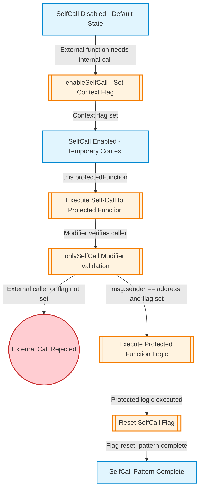
*図14: SelfCall Utility Pattern フロー*

| 項目 | 値 |
|:---|:---|
| **グラフID** | GRAPH-SELFCALL-PATTERN |
| **ノード数** | 9 |
| **エッジ数** | 8 |

外部リエントランシーを防止しながら内部状態遷移を許可するSelfCallパターンのフローを表現します。enableSelfCall()でコンテキストフラグを設定し、onlySelfCallモディファイアで保護された関数への自己呼び出しを可能にします。

#### 関連プロパティ

| ID | プロパティ | カテゴリ |
|:---|:---|:---|
| `PROP-SELFCALL-REENTRANCY-PREVENTION` | 外部呼び出し元はonlySelfCall保護関数を直接呼び出せない | TRANSITION_SECURITY |
| `PROP-SELFCALL-CONTEXT-ISOLATION` | SelfCallフラグは単一トランザクション内で一時的 | STATE_INVARIANT |

### 5.15 Native Token (ETH) Processing Flow

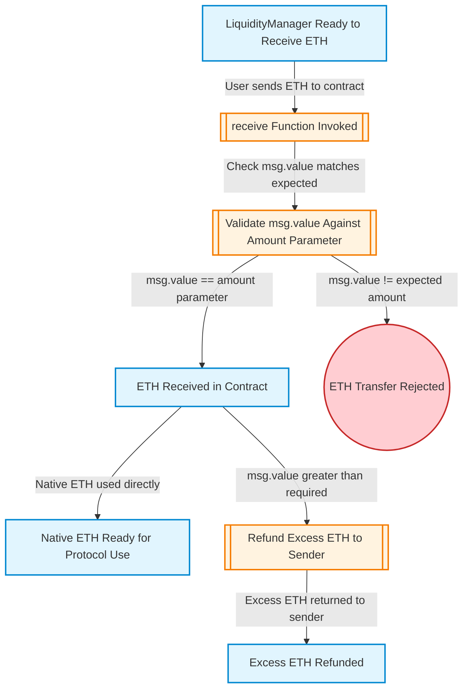
*図15: Native Token (ETH) Processing Flow*

| 項目 | 値 |
|:---|:---|
| **グラフID** | GRAPH-NATIVE-TOKEN-HANDLING |
| **ノード数** | 8 |
| **エッジ数** | 6 |

LiquidityManagerでのネイティブETH処理フローを表現します。receive()関数、msg.value処理、余剰ETHの返金を含みます。

> **注記**: WETHラッピングは使用していません。ネイティブETHは直接処理されます。

#### 関連プロパティ

| ID | プロパティ | カテゴリ |
|:---|:---|:---|
| `PROP-ETH-MSG-VALUE-VALIDATION` | msg.valueは期待される金額と一致する必要がある | INTEGRITY |
| `PROP-ETH-REFUND-SAFETY` | ETH返金はリエントランシーガードを使用する | TRANSITION_SECURITY |

### 5.16 Governance and Administrative Functions

```mermaid
flowchart TD
    classDef stateNode fill:#e1f5fe,stroke:#0288d1,stroke-width:2px
    classDef actionNode fill:#fff3e0,stroke:#f57c00,stroke-width:2px

    STATE_OWNER_IDLE["Contract Owner/Fee Manager Ready"]
    ACTION_FEE_MANAGER_SET_FEE_PARAMS[["setFeeParams[k, T] - Update Incentive Curve [FEE_MANAGER_ROLE]"]]
    ACTION_OWNER_WITHDRAW_REWARDS[["withdrawRewards[amount] - Extract Fee Surplus"]]
    ACTION_OWNER_SET_VERIFIERS[["setVerifiers[addresses] - Rotate Verifier Set"]]
    ACTION_OWNER_REGISTER_TOKEN[["registerToken[tokenInfo] - Add Token to Hub"]]
    ACTION_OWNER_UPDATE_TOKEN[["updateToken[tokenIndex, newInfo] - Modify Config"]]
    ACTION_OWNER_SET_MINTER[["setMinter[address] - Update Minting Authority"]]
    ACTION_OWNER_UPGRADE_CONTRACT[["upgradeToAndCall[impl, data] - UUPS Upgrade"]]
    STATE_ADMIN_ACTION_COMPLETE["Administrative Action Complete"]

    STATE_OWNER_IDLE -->|Fee Manager updates fee parameters| ACTION_FEE_MANAGER_SET_FEE_PARAMS
    STATE_OWNER_IDLE -->|Owner extracts accumulated fees| ACTION_OWNER_WITHDRAW_REWARDS
    STATE_OWNER_IDLE -->|Owner rotates verifier set| ACTION_OWNER_SET_VERIFIERS
    STATE_OWNER_IDLE -->|Owner adds new token to Hub| ACTION_OWNER_REGISTER_TOKEN
    STATE_OWNER_IDLE -->|Owner modifies token configuration| ACTION_OWNER_UPDATE_TOKEN
    STATE_OWNER_IDLE -->|Owner changes minting authority| ACTION_OWNER_SET_MINTER
    STATE_OWNER_IDLE -->|Owner upgrades contract implementation| ACTION_OWNER_UPGRADE_CONTRACT
    ACTION_FEE_MANAGER_SET_FEE_PARAMS -->|Action completed| STATE_ADMIN_ACTION_COMPLETE
    ACTION_OWNER_WITHDRAW_REWARDS -->|Action completed| STATE_ADMIN_ACTION_COMPLETE
    ACTION_OWNER_SET_VERIFIERS -->|Action completed| STATE_ADMIN_ACTION_COMPLETE
    ACTION_OWNER_REGISTER_TOKEN -->|Action completed| STATE_ADMIN_ACTION_COMPLETE
    ACTION_OWNER_UPDATE_TOKEN -->|Action completed| STATE_ADMIN_ACTION_COMPLETE
    ACTION_OWNER_SET_MINTER -->|Action completed| STATE_ADMIN_ACTION_COMPLETE
    ACTION_OWNER_UPGRADE_CONTRACT -->|Action completed| STATE_ADMIN_ACTION_COMPLETE

    class STATE_OWNER_IDLE stateNode
    class ACTION_FEE_MANAGER_SET_FEE_PARAMS actionNode
    class ACTION_OWNER_WITHDRAW_REWARDS actionNode
    class ACTION_OWNER_SET_VERIFIERS actionNode
    class ACTION_OWNER_REGISTER_TOKEN actionNode
    class ACTION_OWNER_UPDATE_TOKEN actionNode
    class ACTION_OWNER_SET_MINTER actionNode
    class ACTION_OWNER_UPGRADE_CONTRACT actionNode
    class STATE_ADMIN_ACTION_COMPLETE stateNode
```
*図16: Governance and Administrative Functions フロー*

| 項目 | 値 |
|:---|:---|
| **グラフID** | GRAPH-GOVERNANCE-ADMIN-FUNCTIONS |
| **ノード数** | 8 |
| **エッジ数** | 8 |

オーナー制限付きの管理機能フローを表現します。手数料パラメータ設定、報酬引き出し、Verifierローテーション、トークン登録、minter設定、コントラクトアップグレードを含みます。

#### 関連プロパティ

| ID | プロパティ | カテゴリ |
|:---|:---|:---|
| `PROP-ADMIN-ONLY-OWNER` | 管理関数はonlyOwnerまたはonlyRole(FEE_MANAGER_ROLE)モディファイアで保護される。setFeeParamsはFEE_MANAGER_ROLEを使用 | AUTHORIZATION |
| `PROP-ADMIN-NO-TIMELOCK` | 管理操作はタイムロックなしで即時に効果を発揮する | STATE_INVARIANT |

#### セキュリティ考慮事項

| 項目 | 説明 |
|:---|:---|
| **タイムロックなし** | 管理操作は遅延なしで即時に効果を発揮する。これは設計上の意図 |
| **オーナー鍵リスク** | オーナー鍵の侵害はプロトコル完全制御を可能にする |
| **責務分離** | タイムロック/マルチシグはコントラクト個別の責務ではなく、Safe wallet等のowner権限を有するスマートコントラクトウォレットの責務。監査対象外 |

---

### 5.17 Adaptor SelfCall Protected Functions

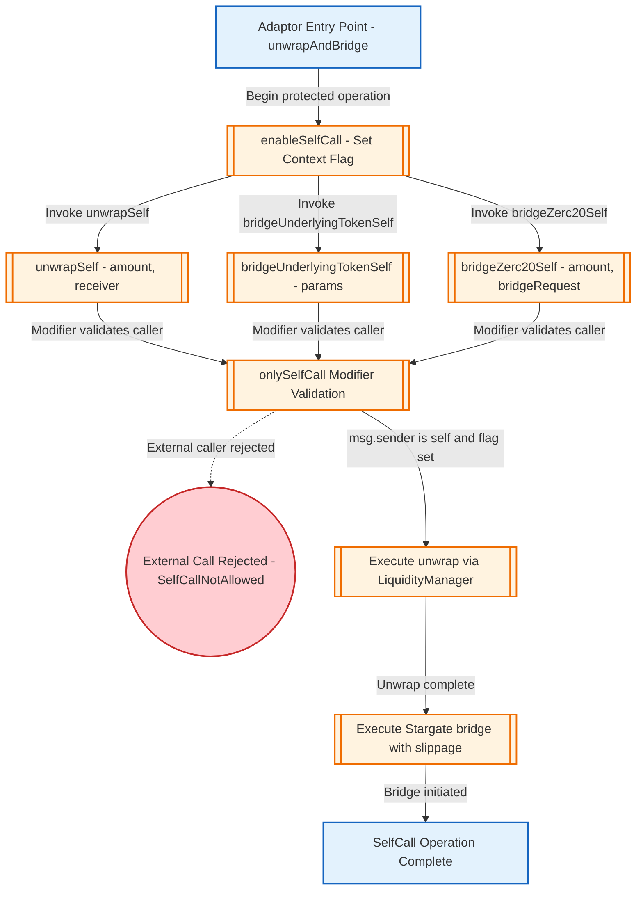
*図17: Adaptor SelfCall Protected Functions フロー*

| 項目 | 値 |
|:---|:---|
| **グラフID** | GRAPH-ADAPTOR-SELFCALL-FUNCTIONS |
| **ノード数** | 10 |
| **エッジ数** | 11 |

AdaptorがSelfCallパターンを使用してunwrapSelf、bridgeUnderlyingTokenSelf、bridgeZerc20Selfを保護し、外部リエントランシーを防止しながら複雑なブリッジ操作を可能にするフローを表現します。

#### 関連プロパティ

| ID | プロパティ | カテゴリ |
|:---|:---|:---|
| `PROP-SUBGRAPH-ADAPTOR-SELFCALL-001` | Adaptor SelfCall保護関数は外部呼出し元によって呼び出せない | AUTHORIZATION |

#### セキュリティ考慮事項

| 項目 | 説明 |
|:---|:---|
| **外部呼出し防止** | unwrapSelf、bridgeUnderlyingTokenSelf、bridgeZerc20Selfは外部から呼び出せない |
| **モディファイア強制** | onlySelfCallはmsg.sender == address(this) AND _isSelfCallAllowedフラグの両方をチェック |
| **アトミック操作** | SelfCallフラグは操作完了またはリバート後にリセットされる |
| **注記** | 図中のSelfCallNotAllowedエラー分岐は、onlySelfCallモディファイアの外からの呼び出しでのみ発生する理論上のケースであり、通常のフローでは到達しない |

---

### 5.18 IncentiveLib Fee Parameter Validation

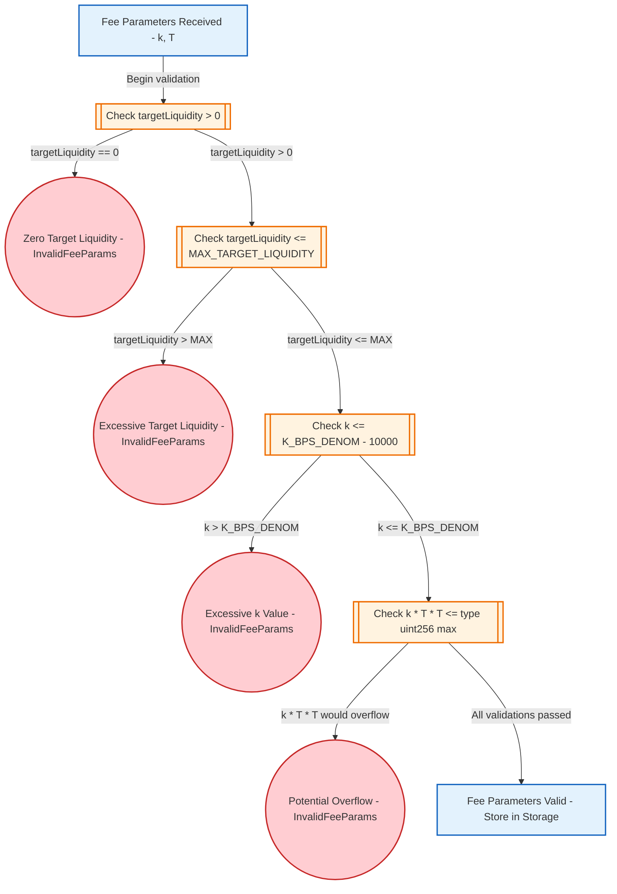
*図18: IncentiveLib Fee Parameter Validation フロー*

| 項目 | 値 |
|:---|:---|
| **グラフID** | GRAPH-INCENTIVE-VALIDATION |
| **ノード数** | 10 |
| **エッジ数** | 9 |

IncentiveLibの手数料パラメータ検証フローを表現します。kとTの値がオーバーフローを防ぎ正確なインセンティブ計算を保証する許容範囲内であることを確認します。

#### 関連プロパティ

| ID | プロパティ | カテゴリ |
|:---|:---|:---|
| `PROP-SUBGRAPH-INCENTIVE-VALIDATION-001` | _validateFeeParamsは無効な手数料パラメータを正しくリジェクトする | INTEGRITY |
| `PROP-INCENTIVE-OVERFLOW-PROTECTION-001` | IncentiveLib計算は検証済みパラメータ境界によりuint256をオーバーフローできない | INTEGRITY |

#### セキュリティ考慮事項

| 項目 | 説明 |
|:---|:---|
| **ゼロ除算防止** | 目標流動性はゼロにできない（密度計算でのゼロ除算を回避） |
| **オーバーフロー防止** | k * T * Tは安全な算術のためuint256に収まる必要がある |
| **境界強制** | kは過剰な手数料を防ぐため100%（10000 bps）で上限 |

---

### 5.19 Adaptor Withdraw Function Flow

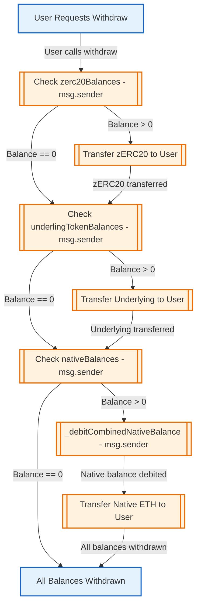
*図19: Adaptor Withdraw Function Flow*

| 項目 | 値 |
|:---|:---|
| **グラフID** | GRAPH-ADAPTOR-WITHDRAW |
| **ノード数** | 9 |
| **エッジ数** | 11 |

Adaptor.withdraw()関数のフローを表現します。ユーザーが失敗したcompose操作やデポジットされた残高からトークンを回収できるようにします。

#### 関連プロパティ

| ID | プロパティ | カテゴリ |
|:---|:---|:---|
| `PROP-ADAPTOR-BALANCE-TRACKING-001` | Adaptorユーザーバランスマッピングは保留残高を正しく追跡し、withdraw時に適切にデビットされる | INTEGRITY |

#### セキュリティ考慮事項

| 項目 | 説明 |
|:---|:---|
| **バランス分離** | ユーザーは自分のバランスのみ引き出せる |
| **転送前ゼロ化** | リエントランシー防止のため転送前にバランスをゼロ化 |
| **全トークンタイプ** | zERC20、underlying、native ETHの引き出しを処理 |

---

### 5.20 LiquidityManager receive() Native Token Handling

```mermaid
flowchart TD
    classDef stateNode fill:#e3f2fd,stroke:#1565c0,stroke-width:2px
    classDef actionNode fill:#fff3e0,stroke:#ef6c00,stroke-width:2px
    classDef errorNode fill:#ffcdd2,stroke:#c62828,stroke-width:2px

    STATE_ETH_SENT_TO_LM["Native ETH Sent to LiquidityManager"]
    ACTION_CHECK_IS_NATIVE_UNDERLYING[["Check _isNativeUnderlying Storage Flag"]]
    STATE_NATIVE_NOT_SUPPORTED(("Revert NativeTokenNotSupported"))
    ACTION_ACCEPT_ETH[["Accept ETH - no-op, balance updated"]]
    STATE_ETH_ACCEPTED["ETH Accepted for wrap Use"]

    STATE_ETH_SENT_TO_LM -->|receive triggered| ACTION_CHECK_IS_NATIVE_UNDERLYING
    ACTION_CHECK_IS_NATIVE_UNDERLYING -->|_isNativeUnderlying == false| STATE_NATIVE_NOT_SUPPORTED
    ACTION_CHECK_IS_NATIVE_UNDERLYING -->|_isNativeUnderlying == true| ACTION_ACCEPT_ETH
    ACTION_ACCEPT_ETH -->|ETH now in contract| STATE_ETH_ACCEPTED

    class STATE_ETH_SENT_TO_LM stateNode
    class ACTION_CHECK_IS_NATIVE_UNDERLYING actionNode
    class STATE_NATIVE_NOT_SUPPORTED errorNode
    class ACTION_ACCEPT_ETH actionNode
    class STATE_ETH_ACCEPTED stateNode
```
*図20: LiquidityManager receive() Native Token Handling フロー*

| 項目 | 値 |
|:---|:---|
| **グラフID** | GRAPH-LM-RECEIVE-NATIVE |
| **ノード数** | 5 |
| **エッジ数** | 4 |

LiquidityManager receive()関数の詳細フローを表現します。underlyingトークンがnative ETHの場合のみETHを受け入れます。

> **注記**: WETHラッピングは使用していません。ネイティブETHは直接処理されます。

#### 関連プロパティ

| ID | プロパティ | カテゴリ |
|:---|:---|:---|
| `PROP-SUBGRAPH-LM-RECEIVE-NATIVE-001` | LiquidityManager receive()は_isNativeUnderlyingがtrueの場合のみETHを受け入れる | INTEGRITY |

#### セキュリティ考慮事項

| 項目 | 説明 |
|:---|:---|
| **ネイティブETH時のみ** | receive()は_isNativeUnderlyingがtrueの場合のみETHを受け入れる |
| **それ以外はリバート** | non-native underlyingコントラクトはETH receive時にリバート |
| **nonReentrant** | receive()はnonReentrantモディファイアで保護される |

---

### 5.21 Adaptor _removeStargateDust Decimal Handling

```mermaid
flowchart TD
    classDef stateNode fill:#e3f2fd,stroke:#1565c0,stroke-width:2px
    classDef actionNode fill:#fff3e0,stroke:#ef6c00,stroke-width:2px
    classDef errorNode fill:#ffcdd2,stroke:#c62828,stroke-width:2px

    STATE_DUST_INPUT["Amount Input for Dust Removal"]
    ACTION_GET_SHARED[["Get stargate.sharedDecimals()"]]
    ACTION_GET_LOCAL[["Get localDecimals (18 for native, token.decimals() otherwise)"]]
    ACTION_CHECK_COMPAT[["Check localDecimals >= sharedDecimals"]]
    STATE_INCOMPATIBLE(("Return 0 - Token Incompatible"))
    ACTION_CALC_RATE[["conversionRate = 10^(localDecimals - sharedDecimals)"]]
    ACTION_REMOVE_DUST[["dustlessAmount = amount - (amount % conversionRate)"]]
    STATE_DUST_REMOVED["Return dustlessAmount"]
    ACTION_QUOTEFEE_HANDLE[["quoteFee: Return tokenBridgeFee = amountAfterUnwrap"]]
    ACTION_EXECUTE_HANDLE[["_executeBridge: Revert OutputTooLow(0, minAmountOut)"]]

    STATE_DUST_INPUT -->|Begin dust removal| ACTION_GET_SHARED
    ACTION_GET_SHARED -->|sharedDecimals obtained| ACTION_GET_LOCAL
    ACTION_GET_LOCAL -->|localDecimals obtained| ACTION_CHECK_COMPAT
    ACTION_CHECK_COMPAT -->|localDecimals < sharedDecimals| STATE_INCOMPATIBLE
    ACTION_CHECK_COMPAT -->|localDecimals >= sharedDecimals| ACTION_CALC_RATE
    ACTION_CALC_RATE -->|conversionRate calculated| ACTION_REMOVE_DUST
    ACTION_REMOVE_DUST -->|Dust removed successfully| STATE_DUST_REMOVED
    STATE_INCOMPATIBLE -->|Called from quoteFee| ACTION_QUOTEFEE_HANDLE
    STATE_INCOMPATIBLE -->|Called from _executeBridge| ACTION_EXECUTE_HANDLE

    class STATE_DUST_INPUT stateNode
    class ACTION_GET_SHARED actionNode
    class ACTION_GET_LOCAL actionNode
    class ACTION_CHECK_COMPAT actionNode
    class STATE_INCOMPATIBLE errorNode
    class ACTION_CALC_RATE actionNode
    class ACTION_REMOVE_DUST actionNode
    class STATE_DUST_REMOVED stateNode
    class ACTION_QUOTEFEE_HANDLE actionNode
    class ACTION_EXECUTE_HANDLE errorNode
```
*図21: Adaptor _removeStargateDust Decimal Handling フロー*

| 項目 | 値 |
|:---|:---|
| **グラフID** | GRAPH-ADAPTOR-REMOVE-STARGATE-DUST |
| **ノード数** | 10 |
| **エッジ数** | 9 |

Adaptor._removeStargateDust()関数の詳細フローを表現します。StargateブリッジのsharedDecimalsとローカルトークンのdecimalsの互換性をチェックし、互換性がない場合（localDecimals < sharedDecimals）は0を返します。

#### 関連プロパティ

| ID | プロパティ | カテゴリ |
|:---|:---|:---|
| `PROP-ADAPTOR-STARGATE-DUST-001` | _removeStargateDustはlocalDecimals < sharedDecimalsの場合0を返し、呼び出し元が適切に処理する | INTEGRITY |

#### セキュリティ考慮事項

| 項目 | 説明 |
|:---|:---|
| **アンダーフロー防止** | localDecimals < sharedDecimalsチェックにより10^(local-shared)計算でのアンダーフローを防止 |
| **呼び出し元の責任** | 呼び出し元は0返却値を適切に処理する必要がある - quoteFeeはfee quoteを返し、_executeBridgeはリバート |
| **意図的な精度損失** | ダスト除去はStargateのsharedDecimals精度に合わせるため意図的に切り捨てる |
| **互換性確認** | このエッジケースは通常発生しないが、不正なトークン設定や将来の変更に対する防御となる |

---

### 5.22 Adaptor lzCompose Cross-Chain Unwrap Flow

```mermaid
flowchart TD
    classDef stateNode fill:#e1f5fe,stroke:#0288d1,stroke-width:2px
    classDef actionNode fill:#fff3e0,stroke:#f57c00,stroke-width:2px

    STATE_USER_CHAIN_A["User on Chain A with zerc20"]
    ACTION_SEND_VIA_OFT[["zerc20.send() with lzCompose option to Adaptor on Chain B"]]
    STATE_ADAPTOR_RECEIVES["Adaptor receives zerc20 on Chain B via lzCompose"]
    ACTION_CALL_UNWRAP[["Adaptor calls LiquidityManager.unwrap() on Chain B"]]
    STATE_UNDERLYING_RECEIVED["Underlying token received on Chain B"]
    ACTION_BRIDGE_BACK[["Send underlying via Stargate bridge back to Chain A"]]
    STATE_USER_RECEIVES["User receives underlying on Chain A"]

    STATE_USER_CHAIN_A -->|"zerc20.send() with lzCompose"| ACTION_SEND_VIA_OFT
    ACTION_SEND_VIA_OFT -->|LayerZero delivers via lzCompose| STATE_ADAPTOR_RECEIVES
    STATE_ADAPTOR_RECEIVES -->|Process received zerc20| ACTION_CALL_UNWRAP
    ACTION_CALL_UNWRAP -->|zerc20 burned, underlying released| STATE_UNDERLYING_RECEIVED
    STATE_UNDERLYING_RECEIVED -->|Bridge underlying to origin chain| ACTION_BRIDGE_BACK
    ACTION_BRIDGE_BACK -->|Stargate delivers to user| STATE_USER_RECEIVES

    class STATE_USER_CHAIN_A stateNode
    class ACTION_SEND_VIA_OFT actionNode
    class STATE_ADAPTOR_RECEIVES stateNode
    class ACTION_CALL_UNWRAP actionNode
    class STATE_UNDERLYING_RECEIVED stateNode
    class ACTION_BRIDGE_BACK actionNode
    class STATE_USER_RECEIVES stateNode
```
*図22: Adaptor lzCompose Cross-Chain Unwrap Flow*

| 項目 | 値 |
|:---|:---|
| **グラフID** | GRAPH-ADAPTOR-LZCOMPOSE-CROSS-CHAIN |
| **ノード数** | 7 |
| **エッジ数** | 6 |

このフローは、ユーザーがChain Aでzerc20を保有し、Chain Bの流動性を使用してunwrapしたい場合の橋渡し役としてAdaptorが機能することを示しています。ユーザーはzerc20のOFT send()メソッドにlzComposeオプションを付けて実行し、Chain BのAdaptorを宛先として送信します。LayerZeroがChain BでlzComposeコールバックを呼び出し、AdaptorがLiquidityManager.unwrap()を実行してunderlyingトークンを取得し、Stargateブリッジ経由でChain Aのユーザーに返送されます。

#### 関連プロパティ

| ID | プロパティ | カテゴリ |
|:---|:---|:---|
| `PROP-ADAPTOR-CROSS-CHAIN-UNWRAP` | Adaptorがzerc20を受け取り、unwrapし、underlyingをブリッジバックするフローが正しく実行される | INTEGRITY |

---

## 6. 境界セキュリティチェックリスト

境界セキュリティに関する33のチェックリスト項目が定義されています。以下に主要なものを示します。完全なリストは[付録C.3](#c3-チェックリスト完全一覧154件)を参照してください。

### 6.1 ユーザー入力検証

| ID | チェック項目 | バグクラス | 重大度ヒント |
|:---|:---|:---|:---|
| `CL-PROP-EDGE-001-USER-INITIATES-WRAP-01` | LiquidityManagerがwrap()関数エントリポイントですべてのユーザー提供wrap額を正しく検証することを確認 | Input Validation Bypass | High |
| `CL-PROP-EDGE-007-USER-INITIATES-UNWRAP-01` | LiquidityManagerがunwrap()関数エントリポイントですべてのユーザー提供unwrap額を正しく検証することを確認 | Input Validation Bypass | High |
| `CL-PROP-EDGE-014-USER-INITIATES-TRANSFER-01` | zERC20転送がvalue <= 2^248-1を信頼境界で正しく検証し、ZK回路互換性を維持することを確認 | Cryptographic Constraint Violation | Critical |

### 6.2 ZKP検証

| ID | チェック項目 | バグクラス | 重大度ヒント |
|:---|:---|:---|:---|
| `CL-PROP-EDGE-021-USER-SUBMITS-TELEPORT-01` | Verifierがテレポートリクエストでユーザー提供のGroth16証明を完全に検証することを確認 | ZKP Soundness Bypass | Critical |
| `CL-PROP-EDGE-021-USER-SUBMITS-TELEPORT-02` | totalTeleportedの単調増加が厳密に強制され、二重支出を防止することを確認 | Double Spend | Critical |

### 6.3 クロスチェーンメッセージング

| ID | チェック項目 | バグクラス | 重大度ヒント |
|:---|:---|:---|:---|
| `CL-PROP-EDGE-023-LAYERZERO-TO-HUB-01` | Hubが_lzReceiveでソースEIDを登録Verifierリストに対して検証することを確認 | Cross-Chain Message Spoofing | Critical |
| `CL-PROP-EDGE-024-LAYERZERO-TO-VERIFIER-01` | Verifierがグローバルルートを保存する前にソースEIDが認可されたHubであることを検証することを確認（推奨事項：setPeerにより既に送信元検証済みのため必須ではない） | Cross-Chain Message Spoofing | Critical |

### 6.4 LayerZero lzComposeコールバック

| ID | チェック項目 | バグクラス | 重大度ヒント |
|:---|:---|:---|:---|
| `CL-PROP-EDGE-028-LAYERZERO-TO-ADAPTOR-01` | Adaptorがmsg.senderがLayerZeroエンドポイントであり、_fromが登録されたzerc20アドレスであることを検証。デコードエラー時はrevertせずイベント発行+returnで資産ロック防止 | Unauthorized Callback / Asset Lock | Critical |
| `CL-PROP-EDGE-028-LAYERZERO-TO-ADAPTOR-02` | amountReceivedLDがminAmountOutスリッページ制限を満たすことを検証し、リファンドロジックを正しく処理することを確認 | Slippage Bypass | High |

> **注記**: リエントランシーが可能であったとしても、具体的な攻撃が存在しない限りは問題なしとします。

---

## 7. プロパティカテゴリ別サマリ

本プロトコルには142のプロパティが定義されており、以下の8カテゴリに分類されています。

| カテゴリ | 説明 | プロパティ数 |
|:---|:---|:---|
| **SOUNDNESS** | 暗号証明システムが偽造できないことを保証するプロパティ | 多数 |
| **INTEGRITY** | データが破損または操作されないことを保証するプロパティ | 多数 |
| **AUTHORIZATION** | 認可されたアクターのみがアクションを実行できることを保証するプロパティ | 多数 |
| **MONOTONICITY** | 値が必要に応じて増加または減少のみすることを保証するプロパティ | 多数 |
| **BOUNDARY_SECURITY** | 信頼境界が適切に強制されることを保証するプロパティ | 多数 |
| **STATE_INVARIANT** | 特定のプログラム状態で保持される必要があるプロパティ | 多数 |
| **TRANSITION_SECURITY** | 状態遷移中に保持される必要があるプロパティ | 多数 |
| **DATA_PROTECTION** | 転送中のデータの機密性と整合性を保証するプロパティ | 多数 |

### カバレッジサマリ

| 項目 | 値 |
|:---|:---|
| グラフ内の総ノード数 | 241 |
| グラフ内の総エッジ数 | 244 |
| 総境界エッジ数 | 20 |
| プロパティを持つノード数 | 241 |
| プロパティを持つエッジ数 | 244 |
| ノードカバレッジ | 100% |
| エッジカバレッジ | 100% |

---

## 8. 結論とフィードバック依頼

本文書では、zERC20プライバシートークンプロトコルの監査に先立ち、以下の内容を整理して提示しました。

1. **プロトコル仕様**: 16のエンティティ、36のデータ構造、メインプログラムグラフと22のサブグラフ
2. **トラストモデル**: 4段階の信頼レベル、5つのオンチェーンコンポーネント、5つのオフチェーンコンポーネント、2つの外部依存関係、20の信頼境界エッジ
3. **プロパティ**: 8カテゴリ、142のプロパティ（100%カバレッジ）
4. **チェックリスト**: 33の境界セキュリティチェックリスト、121のプロパティベースチェックリスト（合計154件）

本文書で提示した仕様、トラストモデル、プロパティ、およびチェックリストについて、貴社からのフィードバックをいただきたく存じます。特に以下の点についてご確認ください。

- 仕様の正確性と完全性
- トラストモデルの妥当性
- 監査範囲の適切性
- 追加で考慮すべきセキュリティ上の懸念

いただいたフィードバックを反映し、最終的な監査計画を策定いたします。

---

## 付録

### 付録A: トラストモデル一覧表

#### A.1 信頼レベル定義

| レベル | 説明 | 監査対応 |
|:---|:---|:---|
| **TRUSTED** | 完全に信頼。侵害は監査範囲外 | 検証不要 |
| **IN_SCOPE** | 監査対象。実装の正当性を検証 | 詳細検証 |
| **SEMI_TRUSTED** | 部分的に信頼。検証/確認が必要 | 境界検証 |
| **UNTRUSTED** | 信頼しない。すべての入力を検証 | 入力検証必須 |

#### A.2 オンチェーンコンポーネント

| コンポーネントID | 名称 | Owner | Deployer | Caller (User) | Caller (Internal) |
|:---|:---|:---|:---|:---|:---|
| COMP-VERIFIER | Verifier Contract | TRUSTED | TRUSTED | UNTRUSTED | SEMI_TRUSTED (LayerZero) |
| COMP-ZERC20 | zERC20 Token Contract | TRUSTED | TRUSTED | UNTRUSTED | IN_SCOPE (LiquidityManager) |
| COMP-LIQUIDITY-MANAGER | LiquidityManager Contract | TRUSTED | TRUSTED | UNTRUSTED | - |
| COMP-HUB | Hub Contract | TRUSTED | TRUSTED | UNTRUSTED | SEMI_TRUSTED (LayerZero) |
| COMP-ADAPTOR | Adaptor Contract | TRUSTED | TRUSTED | UNTRUSTED | SEMI_TRUSTED (Stargate) |

#### A.3 オフチェーンコンポーネント

| コンポーネントID | 名称 | Operator | Caller | Output |
|:---|:---|:---|:---|:---|
| COMP-PROVER | Prover/Decider Service | SEMI_TRUSTED | UNTRUSTED | UNTRUSTED |
| COMP-INDEXER | Indexer Service | SEMI_TRUSTED | UNTRUSTED | SEMI_TRUSTED |
| COMP-CROSSCHAIN-JOB | Cross-Chain Job | SEMI_TRUSTED | - | - |
| COMP-IC-KEY-MANAGER | IC Key Manager Canister | SEMI_TRUSTED | UNTRUSTED | - |
| COMP-IC-STORAGE | IC Storage Canister | SEMI_TRUSTED | UNTRUSTED | - |

#### A.4 外部依存関係

| 依存関係ID | 名称 | 信頼レベル | 検証要件 |
|:---|:---|:---|:---|
| DEP-LAYERZERO | LayerZero v2 Network | SEMI_TRUSTED | Source EID validation required |
| DEP-STARGATE | Stargate Bridge | SEMI_TRUSTED | minAmountOut slippage limits enforced |

#### A.5 信頼境界エッジ一覧

| エッジID | Source → Target | 信頼レベル遷移 | Critical |
|:---|:---|:---|:---|
| EDGE-USER-INITIATES-WRAP | User → LiquidityManager | UNTRUSTED → IN_SCOPE | - |
| EDGE-USER-INITIATES-UNWRAP | User → LiquidityManager | UNTRUSTED → IN_SCOPE | - |
| EDGE-USER-INITIATES-TRANSFER | User → zERC20 | UNTRUSTED → IN_SCOPE | - |
| EDGE-USER-SUBMITS-TELEPORT | User → Verifier | UNTRUSTED → IN_SCOPE | ✓ |
| EDGE-USER-INITIATES-BRIDGE | User → Adaptor | UNTRUSTED → IN_SCOPE | - |
| EDGE-LAYERZERO-TO-HUB | LayerZero → Hub | SEMI_TRUSTED → IN_SCOPE | ✓ |
| EDGE-LAYERZERO-TO-VERIFIER | LayerZero → Verifier | SEMI_TRUSTED → IN_SCOPE | ✓ |
| EDGE-VERIFIER-TO-LAYERZERO | Verifier → LayerZero | IN_SCOPE → SEMI_TRUSTED | - |
| EDGE-HUB-TO-LAYERZERO | Hub → LayerZero | IN_SCOPE → SEMI_TRUSTED | - |
| EDGE-ADAPTOR-TO-STARGATE | Adaptor → Stargate | IN_SCOPE → SEMI_TRUSTED | - |
| EDGE-LAYERZERO-TO-ADAPTOR | LayerZero → Adaptor | SEMI_TRUSTED → IN_SCOPE | ✓ |
| EDGE-LIQUIDITY-MANAGER-TO-ZERC20 | LiquidityManager → zERC20 | IN_SCOPE → IN_SCOPE | - |
| EDGE-VERIFIER-TO-ZERC20-TELEPORT | Verifier → zERC20 | IN_SCOPE → IN_SCOPE | ✓ |
| EDGE-OWNER-UPGRADE | Owner → Contracts | TRUSTED → IN_SCOPE | OOS |
| EDGE-OWNER-SET-MINTER | Owner → zERC20 | TRUSTED → IN_SCOPE | OOS |
| EDGE-OWNER-REGISTER-TOKEN | Owner → Hub | TRUSTED → IN_SCOPE | OOS |
| EDGE-OWNER-SET-VERIFIERS | Owner → Verifier | TRUSTED → IN_SCOPE | OOS |
| EDGE-OWNER-SET-FEE-PARAMS | Owner → LiquidityManager | TRUSTED → IN_SCOPE | OOS |
| EDGE-PROVER-OUTPUT-TO-USER | Prover → User | UNTRUSTED → UNTRUSTED | - |
| EDGE-INDEXER-OUTPUT-TO-USER | Indexer → User | SEMI_TRUSTED → UNTRUSTED | - |

*OOS = Out of Scope (Owner操作は信頼されており、監査対象外)*

---

### 付録B: プロパティ一覧表

#### B.1 カテゴリ別プロパティ数

| カテゴリ | 件数 | 説明 |
|:---|---:|:---|
| STATE_INVARIANT | 39 | 特定のプログラム状態で保持すべき性質 |
| INTEGRITY | 30 | データの破損・改ざんを防ぐ性質 |
| BOUNDARY_SECURITY | 19 | 信頼境界が適切に保護されている性質 |
| TRANSITION_SECURITY | 18 | 状態遷移中に保持すべき性質 |
| AUTHORIZATION | 16 | 権限を持つアクターのみがアクションを実行できる性質 |
| SOUNDNESS | 13 | 暗号学的証明システムの健全性 |
| DATA_PROTECTION | 5 | データの機密性と転送中の整合性 |
| MONOTONICITY | 4 | 値が必要に応じて増加または減少のみする性質 |
| **合計** | **142** | |

#### B.2 プロパティ完全一覧（142件）

##### ノードプロパティ（73件）

| カテゴリ | プロパティ内容 |
|:---|:---|
| STATE_INVARIANT | ユーザー初期状態(IDLE)からの遷移は受信コンポーネントで検証される必要がある |
| STATE_INVARIANT | ユーザーがUnderlying保有状態に達するにはunwrap完了または外部トークン取得が必要 |
| STATE_INVARIANT | ユーザーがzERC20保有状態に達するにはwrap完了またはteleport完了が必要 |
| STATE_INVARIANT | wrap待機状態はBN254フィールド制約内の金額を持つ有効なリクエストが必要 |
| INTEGRITY | 報酬計算はプロトコル損失防止のためfloor丸めを使用する必要がある |
| INTEGRITY | 流動性引出しはユーザーから正確な要求金額を転送する必要がある |
| AUTHORIZATION | zERC20ミントは認可されたminterアドレスのみ実行可能 |
| STATE_INVARIANT | wrap完了状態はLiquidityManagerがunderlyingを保持しzERC20がユーザーにミントされたことを意味する |
| STATE_INVARIANT | unwrap待機状態はユーザーが要求金額分のzERC20残高を持つことが必要 |
| INTEGRITY | 手数料計算はプロトコル損失防止のためceiling丸めを使用する必要がある |
| AUTHORIZATION | zERC20バーンは認可されたminterアドレスのみ実行可能 |
| INTEGRITY | underlying転送は手数料を正しく計算した(amount - fee)を転送する |
| STATE_INVARIANT | unwrap完了状態はzERC20がバーンされunderlyingが手数料差引でユーザーに転送されたことを意味する |
| STATE_INVARIANT | 流動性不足時はインセンティブカーブにより手数料が増加し出力量が抑制される（revertしない） |
| STATE_INVARIANT | zERC20転送待機状態は送信者が十分なzERC20残高を持つことが必要 |
| INTEGRITY | 値検証はBN254フィールド互換性のため value <= 2^248-1 を強制する |
| INTEGRITY | 残高更新は送信者から減算し受信者に正確な転送額を加算する |
| INTEGRITY | ハッシュチェーン更新は(to, value)を248ビット切り捨てのSHA-256で追加する |
| MONOTONICITY | IndexedTransfer発行は単調増加するインデックス値を出力する |
| STATE_INVARIANT | 転送完了状態は残高更新・ハッシュチェーン更新・イベント発行がすべて完了したことを意味する |
| STATE_INVARIANT | 転送拒否(値過大)状態は value > 2^248-1 の場合に発生する |
| STATE_INVARIANT | Verifier待機状態はハッシュチェーン予約と証明処理の準備完了を表す |
| INTEGRITY | ハッシュチェーン予約は将来の証明公開入力バインディング用の不変チェックポイントを保存する |
| STATE_INVARIANT | ハッシュチェーン予約済状態はreservedHashChainsマッピングにチェックポイントが保存されたことを意味する |
| STATE_INVARIANT | 転送ルート証明待機状態は対象インデックスでの事前ハッシュチェーン予約が必要 |
| SOUNDNESS | Nova証明検証は正しい公開入力でIRootDecider.verifyOpaqueNovaProofを呼び出す |
| SOUNDNESS | 転送ルート証明済状態はZKP検証成功後にのみ到達可能 |
| STATE_INVARIANT | 緊急事態発生状態は同一インデックスで2つの有効な証明が異なるルートを生成した場合にのみ発生 |
| STATE_INVARIANT | teleport証明待機状態は証明データを含む有効なteleportリクエストが必要 |
| INTEGRITY | ルート参照検証はprovedTransferRootsまたはglobalTransferRootsにルートが存在することを確認する |
| INTEGRITY | 受信者ハッシュ検証は証明の受信者がmsg.sender派生ハッシュと一致することを保証する |
| MONOTONICITY | 単調性チェックは newTotalTeleported > totalTeleported[recipient] を強制する |
| SOUNDNESS | 引出し証明検証は引出し請求のNovaまたはGroth16証明を検証する |
| INTEGRITY | teleport呼出しは delta = newTotal - oldTotal でzERC20.teleport()を呼び出す |
| STATE_INVARIANT | teleport完了状態は有効な証明の検証・単調性チェック・正しい受信者へのトークンミントを意味する |
| STATE_INVARIANT | teleport拒否状態はいずれかの検証ステップ失敗時に発生する |
| INTEGRITY | ルートリレーは正しいペイロードエンコーディングでLayerZero経由でHubに証明済ルートを送信する |
| STATE_INVARIANT | ルートリレー済状態はLayerZeroメッセージがクロスチェーン配信のため送信されたことを意味する |
| STATE_INVARIANT | Hub待機状態はルート受信とブロードキャストトリガーの準備完了を表す |
| AUTHORIZATION | Hubルート受信は処理前に登録済Verifierリストに対してソースEIDを検証する |
| INTEGRITY | Hub転送ルート更新は正しいトークンインデックススロットにルートを保存する |
| STATE_INVARIANT | 転送ルート更新済状態はtransferRoots[tokenIndex]に新しいルートが含まれることを意味する |
| STATE_INVARIANT | ブロードキャスト待機状態は認可された呼出者によるブロードキャストトリガーを許可する |
| INTEGRITY | Hub集約計算は64トークンルート以下でPoseidonT3ツリーを正しく計算する |
| MONOTONICITY | aggSeqは単調に増加する |
| INTEGRITY | Hubルートブロードキャストは登録済全Verifierに集約ルートを送信する |
| STATE_INVARIANT | グローバルルートブロードキャスト済状態は登録済全VerifierにLayerZeroメッセージが送信されたことを意味する |
| AUTHORIZATION | Verifierグローバルルート保存は保存前にソースEIDが認可されたHubであることを検証する（推奨：setPeerにより既に検証済みのため厳密には必須ではない） |
| STATE_INVARIANT | グローバルルート保存済状態はglobalTransferRoots[aggSeq]に受信ルートが含まれることを意味する |
| STATE_INVARIANT | Indexer待機状態はオフチェーンIndexerがイベント処理準備完了であることを表す |
| INTEGRITY | Indexerイベント監視はすべてのIndexedTransferイベントを損失なく取得する |
| INTEGRITY | Indexerツリービルドはオンチェーンハッシュチェーン計算と一致するMerkleツリーを構築する |
| STATE_INVARIANT | Indexerツリー準備完了状態はMerkleツリーがオンチェーン状態と一致することを意味する |
| INTEGRITY | Indexer証明生成は有効なMerkle包含証明を提供する |
| STATE_INVARIANT | Prover待機状態はdecider-proverサービスが証明変換準備完了であることを表す |
| STATE_INVARIANT | ProverはすべてのユーザーからNova IVC証明を受け入れる |
| STATE_INVARIANT | ジョブキュー済状態はジョブが処理用に保存されたことを意味する |
| STATE_INVARIANT | ジョブ処理中状態はジョブが積極的にGroth16に変換中であることを意味する |
| SOUNDNESS | Groth16変換はIVCセマンティクスを保持する有効なGroth16証明を生成する |
| STATE_INVARIANT | ジョブ完了状態は取得可能な有効なGroth16証明が利用可能であることを意味する |
| STATE_INVARIANT | ジョブ失敗状態はエラー詳細を含む証明変換失敗を示す |
| STATE_INVARIANT | Adaptor待機状態はブリッジリクエスト処理準備完了を表す |
| INTEGRITY | Adaptorブリッジリクエスト受信はスリッページ制限を含むブリッジパラメータを検証する |
| AUTHORIZATION | Adaptor経由unwrapはLiquidityManager unwrapを正しく呼び出す |
| DATA_PROTECTION | Stargate経由ブリッジはminAmountOutスリッページ保護を強制する |
| STATE_INVARIANT | ブリッジ開始済状態はunwrap完了とStargateブリッジリクエスト送信を意味する |
| STATE_INVARIANT | ブリッジ失敗状態は資金が安全に保たれたまま操作失敗を示す |
| DATA_PROTECTION | ステルスアドレス生成はシークレットから暗号学的に安全なステルスアドレスを生成する |
| SOUNDNESS | Nova証明生成はユーザーの転送履歴から有効なIVC証明を生成する |
| STATE_INVARIANT | ユーザーNova証明保有状態はユーザーが請求転送の有効なIVC証明を保持することを意味する |
| AUTHORIZATION | Verifierローテーションは緊急状態中にオーナーのみ呼出可能 |
| AUTHORIZATION | 緊急解除はVerifierローテーション後にオーナーのみ呼出可能 |
| STATE_INVARIANT | 緊急回復済状態は新しいVerifierがアクティブで緊急フラグがクリアされたことを意味する |

##### エッジプロパティ（37件）

| カテゴリ | プロパティ内容 |
|:---|:---|
| BOUNDARY_SECURITY | wrap開始はBN254制約内の有効なwrap金額とユーザー残高が必要 |
| TRANSITION_SECURITY | 報酬計算遷移は正しいパラメータでIncentiveLibを使用する |
| TRANSITION_SECURITY | 流動性引出しはセキュアなトークン転送のためSafeERC20.safeTransferFromを使用する |
| TRANSITION_SECURITY | zERC20ミントは正確な(amount + reward)をユーザーにミントする |
| TRANSITION_SECURITY | wrap完了は正確なパラメータでWrappedイベントを発行する |
| TRANSITION_SECURITY | zERC20取得はユーザー残高がミント金額分増加することを意味する |
| BOUNDARY_SECURITY | unwrap開始はユーザーのzERC20残高内の有効なunwrap金額が必要 |
| TRANSITION_SECURITY | 手数料計算はプロトコル保護のためceiling除算を使用する |
| TRANSITION_SECURITY | zERC20バーンはユーザーから正確なunwrap金額をバーンする |
| TRANSITION_SECURITY | underlying転送はSafeERC20を使用して(amount - fee)を転送する |
| TRANSITION_SECURITY | unwrap完了は正確なパラメータでUnwrappedイベントを発行する |
| TRANSITION_SECURITY | 流動性不足時はインセンティブカーブにより手数料を増加させ出力量を抑制する（revertしない） |
| TRANSITION_SECURITY | underlying取得はunderlyingトークンがユーザーに転送されたことを意味する |
| BOUNDARY_SECURITY | 転送開始は value <= 2^248-1 と送信者残高を検証する |
| TRANSITION_SECURITY | 値検証は転送後の受信者残高にBN254制約を適用する |
| TRANSITION_SECURITY | 値過大は正しくValueTooLargeリバートをトリガーする |
| TRANSITION_SECURITY | 残高更新は送信者と受信者の残高を原子的に更新する |
| TRANSITION_SECURITY | ハッシュチェーン更新は(to, value)をハッシュチェーンに決定論的に追加する |
| TRANSITION_SECURITY | イベント発行は単調インデックスでIndexedTransferを発行する |
| TRANSITION_SECURITY | 転送完了はすべての状態更新(残高、ハッシュ、イベント)の完了を意味する |
| BOUNDARY_SECURITY | teleport送信は有効なGroth16証明と単調なtotalTeleportedが必要 |
| TRANSITION_SECURITY | チェックポイント予約は証明バインディング用の不変チェックポイントを保存する |
| BOUNDARY_SECURITY | LayerZero→Hubはペイロード処理前にソースEIDが認可されたVerifierであることを検証する |
| BOUNDARY_SECURITY | LayerZero→Verifierはグローバルルート保存前にソースEIDが認可されたHubであることを検証する（推奨：setPeerにより既に検証済みのため厳密には必須ではない） |
| BOUNDARY_SECURITY | Verifier→LayerZeroは正しいエンコーディングで証明済ルートをLayerZeroに送信する |
| BOUNDARY_SECURITY | Hub→LayerZeroは省略なく登録済全Verifierにブロードキャストする |
| BOUNDARY_SECURITY | Adaptor→StargateはminAmountOutスリッページ保護を強制する |
| BOUNDARY_SECURITY | LayerZero→Adaptorは送信者がLayerZeroエンドポイントで_fromが登録zerc20、金額がスリッページを満たすことを検証する |
| BOUNDARY_SECURITY | LiquidityManager→zERC20は呼出者が認可されたminterであることが必要 |
| BOUNDARY_SECURITY | Verifier→zERC20(teleport)は呼出者が認可されたverifierで証明が有効であることが必要 |
| BOUNDARY_SECURITY | オーナーアップグレードは呼出者がコントラクトオーナーであることが必要（対象外） |
| BOUNDARY_SECURITY | オーナーminter設定は呼出者がコントラクトオーナーであることが必要（対象外） |
| BOUNDARY_SECURITY | オーナートークン登録は呼出者がコントラクトオーナーであることが必要（対象外） |
| BOUNDARY_SECURITY | オーナーVerifier設定は呼出者がコントラクトオーナーであることが必要（対象外） |
| BOUNDARY_SECURITY | オーナー手数料設定は呼出者がコントラクトオーナーであることが必要（対象外） |
| BOUNDARY_SECURITY | Prover出力はオンチェーン検証で健全性により検証された証明を提供する |
| BOUNDARY_SECURITY | Indexer出力は回路実行中に検証されたMerkle証明を提供する |

##### サブグラフプロパティ（26件）

| カテゴリ | プロパティ内容 |
|:---|:---|
| SOUNDNESS | Nova IVC証明生成はユーザーのシークレットが所有する転送に対してのみ有効な証明を生成する |
| SOUNDNESS | Nova→Groth16変換は証明された文のセマンティック等価性を保持する |
| SOUNDNESS | 転送ルート証明検証はZKPを正しく検証し乖離証明を検出する |
| SOUNDNESS | 引出し証明検証はNovaまたはGroth16証明を正しく検証し公開入力を抽出する |
| INTEGRITY | インセンティブカーブ計算は正しい丸め方向を使用する（報酬はfloor、手数料はceiling） |
| INTEGRITY | Hub集約は登録トークンルート上でPoseidonT3 Merkleツリーを正しく計算する |
| AUTHORIZATION | LayerZeroメッセージフローはペイロード処理前にソースEIDを検証する |
| DATA_PROTECTION | ステルスアドレス生成はシークレットから暗号学的にリンク不可能なアドレスを生成する |
| SOUNDNESS | Poseidonハッシュ実装は衝突耐性がありcircom互換である |
| DATA_PROTECTION | ICキャニスター連携は機密鍵導出と暗号化ストレージを提供する |
| DATA_PROTECTION | Stargateブリッジフローはスリッページ保護を強制し払戻しを正しく処理する |
| SOUNDNESS | Nova折畳スキームは証明を正しく蓄積しIVC健全性を維持する |
| AUTHORIZATION | SelfCallパターンは保護関数への外部再入を防止する |
| INTEGRITY | ネイティブETH処理はmsg.valueを検証しネイティブETHを直接処理する |
| AUTHORIZATION | ガバナンス関数はonlyOwner修飾子を必要とする（対象外） |
| AUTHORIZATION | lzComposeコールバックは送信者がLayerZeroエンドポイントで_fromが登録済zerc20であることを検証する |
| AUTHORIZATION | Adaptor SelfCall保護関数(unwrapSelf, bridgeZerc20Self等)は外部呼出し元によって呼び出せない |
| INTEGRITY | Adaptorユーザーバランスマッピングは保留残高を正しく追跡しwithdraw時に適切にデビットされる |
| INTEGRITY | IncentiveLib._validateFeeParamsは無効な手数料パラメータ(ゼロT、過剰T、過剰k、オーバーフロー)を正しくリジェクトする |
| INTEGRITY | IncentiveLib計算は検証済みパラメータ境界によりuint256をオーバーフローできない |
| INTEGRITY | IncentiveLibはエッジケースを正しく処理する: L=0(最大)、L=T(ゼロ)、L>T(ゼロクランプ)、amount=0(ゼロ) |
| STATE_INVARIANT | enableSelfCallを_isSelfCallAllowedがtrueの状態で呼び出すとSelfCallAlreadyEnabledでリバートする |
| INTEGRITY | LiquidityManager receive()は_isNativeUnderlyingがtrueの場合のみETHを受け入れる |
| STATE_INVARIANT | LiquidityManagerはunderlyingBalance >= feeSurplus不変条件を維持し手数料余剰が常に引出し可能であることを保証する |
| AUTHORIZATION | IMintableBurnableERC20インターフェース実装(zERC20)はmintとburn関数にonlyMinter認可を必要とする |
| INTEGRITY | Adaptor._removeStargateDust()はlocalDecimals < sharedDecimals時に0を返し、呼び出し元はこのエッジケースを適切に処理する |

##### システムワイドプロパティ（5件）

| カテゴリ | プロパティ内容 |
|:---|:---|
| SOUNDNESS | ZKPシステム(Nova + Groth16)は健全性を維持する（bn254は100bit以下のセキュリティ、burn address衝突は89bitまで低下、既知問題としてスコープ外） |
| MONOTONICITY | 単調なtotalTeleportedにより二重支払いを防止する（同一teleportの二重実行不可） |
| AUTHORIZATION | クロスチェーンメッセージはソースEID検証により認証される |
| AUTHORIZATION | zERC20ミントはLiquidityManager.mint()とVerifier.teleport()の2つの認可経路のみで実行可能 |
| INTEGRITY | すべてのzERC20値はBN254スカラーフィールド互換性のため <= 2^248-1 に制約される |

---

### 付録C: チェックリスト一覧表

#### C.1 概要

本付録では、監査対象のセキュリティチェックリストを重要度別・カテゴリ別に整理します。

#### C.2 重要度別チェックリスト分布

| 重要度 | 件数 | 説明 |
|:---|---:|:---|
| Critical | 53 | ZKP健全性、二重支払い防止、クロスチェーン認証 |
| High | 62 | 入力検証、状態整合性、暗号実装 |
| Medium | 30 | 丸め誤差、シリアライズ整合性、パラメータ検証 |
| Low | 12 | サービス可用性、マイナーな状態不整合 |
| Informational | 5 | Owner操作（監査対象外） |

#### C.3 チェックリスト完全一覧（154件）

##### 境界セキュリティチェック（33件）

| ID | 重要度 | チェック内容 |
|:---|:---|:---|
| `CL-PROP-EDGE-001-USER-INITIATES-WRAP-01` | High | LiquidityManagerエントリでのユーザーwrap金額検証の信頼境界整合性を検証する |
| `CL-PROP-EDGE-001-USER-INITIATES-WRAP-02` | High | wrap処理前にwrapリクエストデータを正しく検証する実装を確認する |
| `CL-PROP-EDGE-007-USER-INITIATES-UNWRAP-01` | High | LiquidityManagerエントリでのユーザーunwrap金額検証の信頼境界整合性を検証する |
| `CL-PROP-EDGE-007-USER-INITIATES-UNWRAP-02` | Medium | 手数料計算がceiling丸めを使用しプロトコルを過少徴収から保護することを確認する |
| `CL-PROP-EDGE-014-USER-INITIATES-TRANSFER-01` | Critical | zERC20転送時のBN254フィールド制約適用の信頼境界整合性を検証する |
| `CL-PROP-EDGE-014-USER-INITIATES-TRANSFER-02` | Critical | SHA-256を248ビット切り捨てで使用して転送データを追加する実装を確認する |
| `CL-PROP-EDGE-021-USER-SUBMITS-TELEPORT-01` | Critical | ミント前のGroth16証明検証の信頼境界整合性を検証する |
| `CL-PROP-EDGE-021-USER-SUBMITS-TELEPORT-02` | Critical | totalTeleportedの厳密な増加を強制し二重支払いを防止する実装を確認する |
| `CL-PROP-EDGE-021-USER-SUBMITS-TELEPORT-03` | Critical | ルートが証明済またはグローバルルートに存在することを確認する実装を検証する |
| `CL-PROP-EDGE-023-LAYERZERO-TO-HUB-01` | Critical | LayerZeroメッセージ処理前のソースEID検証の信頼境界整合性を検証する |
| `CL-PROP-EDGE-023-LAYERZERO-TO-HUB-02` | High | 正しいトークンインデックススロットにルートを保存する実装を確認する |
| `CL-PROP-EDGE-024-LAYERZERO-TO-VERIFIER-01` | Critical | グローバルルート保存前のHub EID検証の信頼境界整合性を検証する |
| `CL-PROP-EDGE-024-LAYERZERO-TO-VERIFIER-02` | High | 集約シーケンスと共にグローバルルートを正しく保存する実装を確認する |
| `CL-PROP-EDGE-025-VERIFIER-TO-LAYERZERO-01` | High | アウトバウンドメッセージのエンコーディングと宛先正確性の信頼境界整合性を検証する |
| `CL-PROP-EDGE-026-HUB-TO-LAYERZERO-01` | High | 登録済全Verifierへの省略なしブロードキャストの信頼境界整合性を検証する |
| `CL-PROP-EDGE-026-HUB-TO-LAYERZERO-02` | Critical | PoseidonT3 Merkleツリーを正しく計算する実装を確認する |
| `CL-PROP-EDGE-027-ADAPTOR-TO-STARGATE-01` | High | minAmountOutスリッページ保護適用の信頼境界整合性を検証する |
| `CL-PROP-EDGE-028-LAYERZERO-TO-ADAPTOR-01` | Critical | lzComposeコールバック認証とスリッページ検証の信頼境界整合性を検証する |
| `CL-PROP-EDGE-028-LAYERZERO-TO-ADAPTOR-02` | High | OFTコンポーズメッセージ構造を正しくデコードする実装を確認する |
| `CL-PROP-EDGE-029-LIQUIDITY-MANAGER-TO-ZERC20-01` | Critical | mint/burn呼出しでのMinter認可の信頼境界整合性を検証する |
| `CL-PROP-EDGE-030-VERIFIER-TO-ZERC20-TELEPORT-01` | Critical | teleportミンティングでのVerifier認可の信頼境界整合性を検証する |
| `CL-PROP-EDGE-030-VERIFIER-TO-ZERC20-TELEPORT-02` | Critical | ミント金額をdeltaとして正しく計算する実装を確認する |
| `CL-PROP-EDGE-031-OWNER-UPGRADE-01` | Informational | UUPSアップグレードでのOwner認可の信頼境界整合性を検証する（対象外） |
| `CL-PROP-EDGE-032-OWNER-SET-MINTER-01` | Informational | minter変更でのOwner認可の信頼境界整合性を検証する（対象外） |
| `CL-PROP-EDGE-033-OWNER-REGISTER-TOKEN-01` | Informational | トークン登録でのOwner認可の信頼境界整合性を検証する（対象外） |
| `CL-PROP-EDGE-034-OWNER-SET-VERIFIERS-01` | Informational | Verifierローテーションでのowner認可の信頼境界整合性を検証する（対象外） |
| `CL-PROP-EDGE-035-OWNER-SET-FEE-PARAMS-01` | Informational | 手数料設定でのOwner認可の信頼境界整合性を検証する（対象外） |
| `CL-PROP-EDGE-036-PROVER-OUTPUT-TO-USER-01` | High | 証明がオンチェーン検証で健全性により検証されることを確認する |
| `CL-PROP-EDGE-036-PROVER-OUTPUT-TO-USER-02` | Medium | Groth16証明構造がオンチェーン検証者の期待と一致することを確認する |
| `CL-PROP-EDGE-037-INDEXER-OUTPUT-TO-USER-01` | High | ZK回路検証によるMerkle証明有効性保証を検証する |
| `CL-PROP-EDGE-037-INDEXER-OUTPUT-TO-USER-02` | High | Merkle構造がオンチェーンハッシュチェーン計算と一致することを確認する |
| `CL-CRITICAL-DUAL-MINTING-PATHWAYS-01` | Critical | LiquidityManagerとVerifier以外の不正なミント経路が存在しないことを検証する |
| `CL-CRITICAL-CROSS-CHAIN-ISOLATION-01` | Critical | 全受信コントラクトでEID検証によるクロスチェーンメッセージ分離完全性を検証する |

##### ノードプロパティチェック（73件）

| ID | 重要度 | チェック内容 |
|:---|:---|:---|
| `CL-PROP-NODE-001-STATE-USER-IDLE-01` | Medium | ユーザー初期状態からの遷移が受信コンポーネントで検証されることを確認する |
| `CL-PROP-NODE-002-STATE-USER-HAS-UNDERLYING-01` | High | Underlying保有状態が有効なunwrap完了経由でのみ到達可能であることを検証する |
| `CL-PROP-NODE-003-STATE-USER-HAS-ZERC20-01` | Critical | zERC20保有状態がwrapまたはteleport完了経由でのみ到達可能であることを検証する |
| `CL-PROP-NODE-004-STATE-LM-AWAITING-WRAP-01` | Critical | wrap待機状態がwrap金額にBN254フィールド制約を適用することを検証する |
| `CL-PROP-NODE-005-ACTION-LM-CALCULATE-REWARD-01` | Medium | wrap報酬計算がfloor丸めを使用することを検証する |
| `CL-PROP-NODE-006-ACTION-LM-PULL-LIQUIDITY-01` | High | 流動性引出しが正確な要求金額を転送することを検証する |
| `CL-PROP-NODE-007-ACTION-LM-MINT-ZERC20-01` | Critical | zERC20ミントが認可されたminterを必要とすることを検証する |
| `CL-PROP-NODE-008-STATE-WRAP-COMPLETE-01` | High | wrap完了状態がpull+mint操作の原子性を意味することを検証する |
| `CL-PROP-NODE-009-STATE-LM-AWAITING-UNWRAP-01` | High | unwrap待機状態が十分なzERC20残高を必要とすることを検証する |
| `CL-PROP-NODE-010-ACTION-LM-CALCULATE-FEE-01` | Medium | 手数料計算がceiling丸めを使用することを検証する |
| `CL-PROP-NODE-011-ACTION-LM-BURN-ZERC20-01` | Critical | zERC20バーンが認可されたminterを必要とすることを検証する |
| `CL-PROP-NODE-012-ACTION-LM-TRANSFER-UNDERLYING-01` | High | underlying転送が正しい(amount - fee)をユーザーに送信することを検証する |
| `CL-PROP-NODE-013-STATE-UNWRAP-COMPLETE-01` | High | unwrap完了状態がburn+transfer操作の原子性を意味することを検証する |
| `CL-PROP-NODE-014-STATE-UNWRAP-FAILED-INSUFFICIENT-LIQUIDITY-01` | High | 流動性不足時にインセンティブカーブで手数料を上げて出力量を抑制することを検証する（revertしない） |
| `CL-PROP-NODE-015-STATE-ZERC20-AWAITING-TRANSFER-01` | High | zERC20転送待機状態が十分な送信者残高を必要とすることを検証する |
| `CL-PROP-NODE-016-ACTION-ZERC20-VALIDATE-VALUE-01` | Critical | 値検証がBN254フィールド制約を適用することを検証する |
| `CL-PROP-NODE-017-ACTION-ZERC20-UPDATE-BALANCES-01` | Critical | 残高更新が値の保存を維持することを検証する |
| `CL-PROP-NODE-018-ACTION-ZERC20-UPDATE-HASH-CHAIN-01` | Critical | ハッシュチェーン更新が248ビット切り捨てでSHA-256を使用することを検証する |
| `CL-PROP-NODE-019-ACTION-ZERC20-EMIT-INDEXED-TRANSFER-01` | High | IndexedTransfer発行が単調インデックスを出力することを検証する |
| `CL-PROP-NODE-020-STATE-TRANSFER-COMPLETE-01` | High | 転送完了状態が全転送操作の原子的完了を意味することを検証する |
| `CL-PROP-NODE-021-STATE-TRANSFER-REJECTED-01` | Medium | 転送拒否状態が value > 2^248-1 の場合にのみ到達することを検証する |
| `CL-PROP-NODE-022-STATE-VERIFIER-IDLE-01` | Medium | Verifierコントラクトがステートレスで操作準備完了であることを確認する |
| `CL-PROP-NODE-023-ACTION-RESERVE-HASH-CHAIN-01` | High | ハッシュチェーンチェックポイントが予約後不変であることを検証する |
| `CL-PROP-NODE-024-STATE-HASH-CHAIN-RESERVED-01` | Medium | ハッシュチェーン予約済状態がマッピングにチェックポイント保存を意味することを検証する |
| `CL-PROP-NODE-025-STATE-AWAITING-PROOF-01` | Critical | 転送ルート証明が事前ハッシュチェーン予約を必要とすることを検証する |
| `CL-PROP-NODE-026-ACTION-VALIDATE-NOVA-01` | Critical | Nova証明検証が予約済チェックポイントからの正しい公開入力を使用することを検証する |
| `CL-PROP-NODE-027-STATE-ROOT-PROVED-01` | Critical | 転送ルート証明済状態が有効なZKP検証後にのみ到達可能であることを検証する |
| `CL-PROP-NODE-028-STATE-EMERGENCY-01` | Critical | 緊急状態が乖離する有効な証明によってのみトリガーされることを検証する |
| `CL-PROP-NODE-029-STATE-AWAITING-TELEPORT-01` | High | teleport処理が有効な証明データ提出を必要とすることを検証する |
| `CL-PROP-NODE-030-ACTION-VALIDATE-ROOT-REF-01` | Critical | ルート参照検証が証明済とグローバルルートマッピング両方をチェックすることを検証する |
| `CL-PROP-NODE-031-ACTION-VALIDATE-RECIPIENT-01` | Critical | 受信者ハッシュが証明をmsg.senderにバインドすることを検証する |
| `CL-PROP-NODE-032-ACTION-CHECK-MONOTONICITY-01` | Critical | 単調性チェックが二重支払いを防止することを検証する |
| `CL-PROP-NODE-033-ACTION-VALIDATE-WITHDRAWAL-PROOF-01` | Critical | 引出し証明が正しい入力でGroth16検証を使用することを検証する |
| `CL-PROP-NODE-034-ACTION-CALL-TELEPORT-01` | Critical | teleport delta計算が正しいことを検証する |
| `CL-PROP-NODE-035-STATE-TELEPORT-COMPLETE-01` | Critical | teleport完了状態が全検証パスを必要とすることを検証する |
| `CL-PROP-NODE-036-STATE-TELEPORT-REJECTED-01` | Low | teleport拒否が適切なエラー表示を提供することを検証する |
| `CL-PROP-NODE-037-ACTION-RELAY-ROOT-01` | High | ルートリレーが正しいLayerZeroエンコーディングと宛先を使用することを検証する |
| `CL-PROP-NODE-038-STATE-ROOT-RELAYED-01` | Medium | ルートリレー済状態がLayerZeroメッセージ送信を意味することを検証する |
| `CL-PROP-NODE-039-STATE-HUB-IDLE-01` | Medium | Hubコントラクトがステートレスで操作準備完了であることを確認する |
| `CL-PROP-NODE-040-ACTION-HUB-RECEIVE-ROOT-01` | Critical | Hubが登録済Verifierリストに対してソースEIDを検証することを検証する |
| `CL-PROP-NODE-041-ACTION-HUB-UPDATE-TRANSFER-ROOT-01` | Critical | Hubが正しいトークンインデックススロットに転送ルートを保存することを検証する |
| `CL-PROP-NODE-042-STATE-TRANSFER-ROOT-UPDATED-01` | High | 転送ルート更新済状態がストレージ完了を意味することを検証する |
| `CL-PROP-NODE-043-STATE-AWAITING-BROADCAST-01` | Medium | ブロードキャスト待機状態がパーミッションレスブロードキャストトリガーを許可することを検証する |
| `CL-PROP-NODE-044-ACTION-HUB-COMPUTE-AGGREGATION-01` | Critical | HubがPoseidonT3集約ツリーを正しく計算することを検証する |
| `CL-PROP-NODE-045-ACTION-HUB-INCREMENT-AGG-SEQ-01` | Critical | aggSeqがリセットなく単調増加することを検証する |
| `CL-PROP-NODE-046-ACTION-HUB-BROADCAST-ROOT-01` | High | Hubが登録済全Verifierにブロードキャストすることを検証する |
| `CL-PROP-NODE-047-STATE-GLOBAL-ROOT-BROADCAST-01` | High | グローバルルートブロードキャスト済状態が完全なメッセージ配信を意味することを検証する |
| `CL-PROP-NODE-048-ACTION-VERIFIER-SAVE-GLOBAL-ROOT-01` | Critical | Verifierがグローバルルート保存前にHubを認証することを検証する |
| `CL-PROP-NODE-049-STATE-GLOBAL-ROOT-SAVED-01` | High | グローバルルート保存済状態が正しいストレージを意味することを検証する |
| `CL-PROP-NODE-050-STATE-INDEXER-IDLE-01` | Low | Indexer可用性監視が存在することを確認する |
| `CL-PROP-NODE-051-ACTION-INDEXER-WATCH-EVENTS-01` | Medium | IndexerがすべてのIndexedTransferイベントを損失なく取得することを検証する |
| `CL-PROP-NODE-052-ACTION-INDEXER-BUILD-TREE-01` | High | Indexer Merkleツリーがオンチェーン計算と一致することを検証する |
| `CL-PROP-NODE-053-STATE-INDEXER-TREE-READY-01` | Medium | Indexerツリー準備完了状態がオンチェーン一貫性を意味することを検証する |
| `CL-PROP-NODE-054-ACTION-INDEXER-GENERATE-PROOFS-01` | Medium | Indexerが有効なMerkle包含証明を生成することを検証する |
| `CL-PROP-NODE-055-STATE-PROVER-IDLE-01` | Low | Decider-Proverサービス可用性監視を確認する |
| `CL-PROP-NODE-056-ACTION-PROVER-RECEIVE-IVC-01` | Medium | Proverが検閲なしにすべてのユーザーからIVC証明を受け入れることを検証する |
| `CL-PROP-NODE-057-STATE-JOB-QUEUED-01` | Low | キュー済ジョブが永続化され損失されないことを検証する |
| `CL-PROP-NODE-058-STATE-JOB-PROCESSING-01` | Low | 処理中ジョブがタイムアウトとリカバリを持つことを検証する |
| `CL-PROP-NODE-059-ACTION-PROVER-CONVERT-TO-GROTH16-01` | Critical | Nova→Groth16変換が証明セマンティクスを保持することを検証する |
| `CL-PROP-NODE-060-STATE-JOB-COMPLETED-01` | Medium | ジョブ完了状態が有効なGroth16証明利用可能を意味することを検証する |
| `CL-PROP-NODE-061-STATE-JOB-FAILED-01` | Low | ジョブ失敗状態が証明変換失敗のエラー詳細を提供することを検証する |
| `CL-PROP-NODE-062-STATE-ADAPTOR-IDLE-01` | Low | Adaptorがステートレスでブリッジリクエスト準備完了であることを確認する |
| `CL-PROP-NODE-063-ACTION-ADAPTOR-RECEIVE-UNWRAP-BRIDGE-01` | High | スリッページ制限を含むブリッジリクエスト検証を検証する |
| `CL-PROP-NODE-064-ACTION-ADAPTOR-UNWRAP-VIA-LM-01` | Critical | AdaptorがLiquidityManagerを正しく呼び出してunwrapすることを検証する |
| `CL-PROP-NODE-065-ACTION-ADAPTOR-BRIDGE-VIA-STARGATE-01` | High | StargateブリッジがminAmountOutスリッページ保護を強制することを検証する |
| `CL-PROP-NODE-066-STATE-BRIDGE-INITIATED-01` | High | ブリッジ開始済状態が事前unwrap完了を意味することを検証する |
| `CL-PROP-NODE-067-STATE-BRIDGE-FAILED-01` | Critical | ブリッジ失敗がユーザー資金を安全に保つことを検証する |
| `CL-PROP-NODE-068-ACTION-USER-GENERATE-STEALTH-01` | Critical | ステルスアドレス生成が暗号学的に安全であることを検証する |
| `CL-PROP-NODE-069-ACTION-USER-GENERATE-NOVA-PROOF-01` | Critical | Nova IVC証明生成がシークレット対アドレスバインディングを検証することを確認する |
| `CL-PROP-NODE-070-STATE-USER-HAS-NOVA-PROOF-01` | Critical | ユーザーNova証明保有状態が有効なIVC証明所有権を意味することを検証する |
| `CL-PROP-NODE-071-VERIFIER-ROTATE-01` | Critical | Verifierローテーションが緊急時のオーナーに制限されることを検証する |
| `CL-PROP-NODE-072-EMERGENCY-DEACTIVATE-01` | Critical | 緊急解除が事前Verifierローテーションを必要とすることを検証する |
| `CL-PROP-NODE-073-EMERGENCY-RECOVERED-01` | High | 緊急回復済状態が新しいVerifierアクティブを意味することを検証する |

##### エッジプロパティチェック（18件）

| ID | 重要度 | チェック内容 |
|:---|:---|:---|
| `CL-PROP-EDGE-002-LM-CALCULATES-REWARD-01` | Medium | 報酬計算が正しいIncentiveLibパラメータを使用することを検証する |
| `CL-PROP-EDGE-003-LM-PULLS-LIQUIDITY-01` | High | トークン引出しにSafeERC20.safeTransferFromを使用することを検証する |
| `CL-PROP-EDGE-004-LM-MINTS-ZERC20-01` | Critical | 正確な(amount + reward)をユーザーにミントすることを検証する |
| `CL-PROP-EDGE-005-WRAP-COMPLETE-01` | Low | 正確なパラメータでWrappedイベントが発行されることを検証する |
| `CL-PROP-EDGE-006-USER-NOW-HAS-ZERC20-01` | Critical | ユーザー残高がミント金額分増加することを検証する |
| `CL-PROP-EDGE-008-LM-CALCULATES-FEE-01` | Medium | 手数料計算がceiling除算を使用することを検証する |
| `CL-PROP-EDGE-009-LM-BURNS-ZERC20-01` | Critical | 正確なunwrap金額がユーザーからバーンされることを検証する |
| `CL-PROP-EDGE-010-LM-TRANSFERS-UNDERLYING-01` | High | LiquidityManagerがSafeERC20を使用して正確な(amount - fee)を転送することを検証する |
| `CL-PROP-EDGE-011-UNWRAP-COMPLETE-01` | Low | 正確なパラメータでUnwrappedイベントが発行されることを検証する |
| `CL-PROP-EDGE-012-UNWRAP-INSUFFICIENT-LIQUIDITY-01` | High | 流動性不足時にインセンティブカーブで手数料を上げて出力量を抑制することを検証する（revertしない） |
| `CL-PROP-EDGE-013-USER-NOW-HAS-UNDERLYING-01` | High | SafeERC20.safeTransferがユーザーのトークン受領を保証することを検証する |
| `CL-PROP-EDGE-015-ZERC20-VALIDATES-VALUE-01` | Critical | _afterTokenTransferが全転送にBN254制約を適用することを検証する |
| `CL-PROP-EDGE-016-VALUE-TOO-LARGE-01` | High | ValueTooLargeリバートが正しくトリガーされることを検証する |
| `CL-PROP-EDGE-017-ZERC20-UPDATES-BALANCES-01` | Medium | OpenZeppelin _transferを使用した原子的残高更新を検証する |
| `CL-PROP-EDGE-018-ZERC20-UPDATES-HASH-CHAIN-01` | Critical | ハッシュチェーン更新が248ビット切り捨ての決定論的SHA-256であることを検証する |
| `CL-PROP-EDGE-019-ZERC20-EMITS-EVENT-01` | Medium | 単調インデックスでIndexedTransferイベントが発行されることを検証する |
| `CL-PROP-EDGE-020-TRANSFER-COMPLETE-01` | Medium | 転送完了が全状態更新完了を意味することを検証する |
| `CL-PROP-EDGE-022-VERIFIER-RESERVES-CHECKPOINT-01` | Critical | チェックポイント予約がインデックスごとに一度だけ書込み可能であることを検証する |

##### サブグラフチェック（27件）

| ID | 重要度 | チェック内容 |
|:---|:---|:---|
| `CL-PROP-SUBGRAPH-NOVA-GEN-001-01` | Critical | Nova IVC証明生成がシークレット所有権を必要とすることを検証する |
| `CL-PROP-SUBGRAPH-NOVA-TO-GROTH16-001-01` | Critical | Nova→Groth16変換がセマンティック等価性を保持することを検証する |
| `CL-PROP-SUBGRAPH-VERIFY-ROOT-001-01` | Critical | IRootDecider経由のオンチェーンルート証明検証を検証する |
| `CL-PROP-SUBGRAPH-WITHDRAW-VERIFY-001-01` | Critical | 引出し証明検証と公開入力抽出を検証する |
| `CL-PROP-SUBGRAPH-INCENTIVE-001-01` | Medium | インセンティブカーブが正しい丸め方向を使用することを検証する |
| `CL-PROP-SUBGRAPH-HUB-AGG-001-01` | High | Hub PoseidonT3 Merkleツリー計算を検証する |
| `CL-PROP-SUBGRAPH-LZ-FLOW-001-01` | Critical | LayerZeroメッセージフローがソースEIDを検証することを確認する |
| `CL-PROP-SUBGRAPH-STEALTH-001-01` | High | ステルスアドレスのリンク不可能性を検証する |
| `CL-PROP-SUBGRAPH-POSEIDON-001-01` | Critical | Poseidonハッシュ衝突耐性とcircom互換性を検証する |
| `CL-PROP-SUBGRAPH-IC-001-01` | High | ICキャニスターがvetKd経由で機密鍵導出を提供することを検証する |
| `CL-PROP-SUBGRAPH-STARGATE-001-01` | High | Stargateブリッジがスリッページ保護を強制し払戻しを処理することを検証する |
| `CL-PROP-SUBGRAPH-NOVA-FOLDING-001-01` | Critical | Nova折畳スキームがIVC健全性を維持することを検証する |
| `CL-PROP-SUBGRAPH-SELFCALL-001-01` | High | SelfCallパターンが外部再入を防止することを検証する |
| `CL-PROP-SUBGRAPH-NATIVE-TOKEN-001-01` | Medium | ネイティブETH処理がmsg.valueを検証しネイティブETHを直接処理することを検証する |
| `CL-PROP-SUBGRAPH-GOVERNANCE-001-01` | Critical | ガバナンス関数がonlyOwner修飾子で制限されることを検証する（対象外） |
| `CL-PROP-SUBGRAPH-LZCOMPOSE-001-01` | Critical | lzComposeコールバックが送信者を認証し_fromが登録済zerc20であることを検証する |
| `CL-PROP-SUBGRAPH-ADAPTOR-SELFCALL-001-01` | High | Adaptor SelfCall保護関数が外部呼出しを拒否することを検証する |
| `CL-PROP-ADAPTOR-BALANCE-TRACKING-001-01` | High | Adaptor withdraw()が全トークンタイプを正しく処理することを検証する |
| `CL-PROP-SUBGRAPH-INCENTIVE-VALIDATION-001-01` | Medium | IncentiveLib._validateFeeParamsが無効パラメータを拒否することを検証する |
| `CL-PROP-INCENTIVE-EDGE-CASES-001-01` | Medium | IncentiveLibが数学的エッジケースを正しく処理することを検証する |
| `CL-PROP-SELFCALL-ALREADY-ENABLED-001-01` | Medium | enableSelfCallが既に有効な状態でリバートすることを検証する |
| `CL-PROP-SUBGRAPH-LM-RECEIVE-NATIVE-001-01` | Medium | LiquidityManager receive()がネイティブunderlying時のみETHを受け入れることを検証する |
| `CL-PROP-LM-BALANCE-CONSISTENCY-001-01` | High | LiquidityManagerがunderlyingBalance >= feeSurplus不変条件を維持することを検証する |
| `CL-PROP-INTERFACE-MINTABLE-BURNABLE-001-01` | Critical | IMintableBurnableERC20実装がonlyMinterを強制することを検証する |
| `CL-PROP-ADAPTOR-STARGATE-DUST-001-01` | Medium | _removeStargateDustがlocalDecimals < sharedDecimals時に0を返し呼び出し元が適切に処理することを検証する |

##### システムワイドチェック（5件）

| ID | 重要度 | チェック内容 |
|:---|:---|:---|
| `CL-PROP-CRITICAL-001-ZKP-SOUNDNESS-01` | Critical | **重要**: ZKPシステムが健全性を維持することを検証する（bn254は100bit以下、burn address衝突は89bit既知問題） |
| `CL-PROP-CRITICAL-002-DOUBLE-SPEND-01` | Critical | **重要**: 単調なtotalTeleportedによる二重支払い防止を検証する |
| `CL-PROP-CRITICAL-003-CROSS-CHAIN-INTEGRITY-01` | Critical | **重要**: ソースEIDによるクロスチェーンメッセージ認証を検証する |
| `CL-PROP-CRITICAL-004-MINTING-AUTH-01` | Critical | **重要**: zERC20ミントが認可経路のみに制限されることを検証する |
| `CL-PROP-CRITICAL-005-VALUE-CONSTRAINT-01` | Critical | **重要**: 全zERC20値がBN254スカラーフィールドに制約されることを検証する |

---

