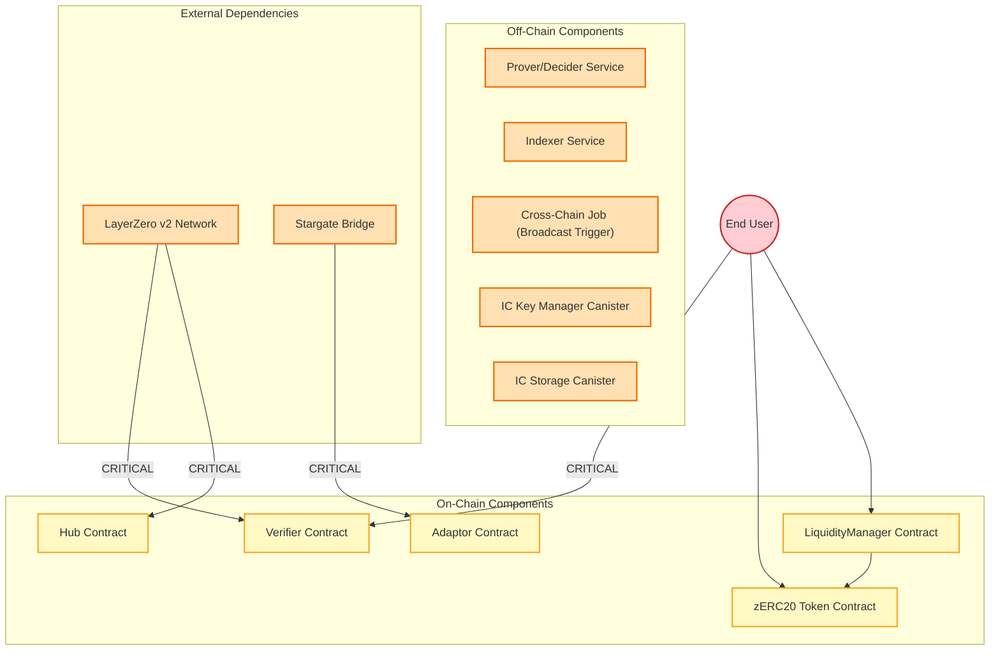
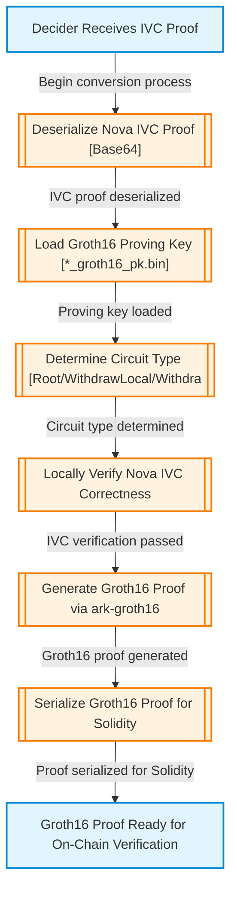
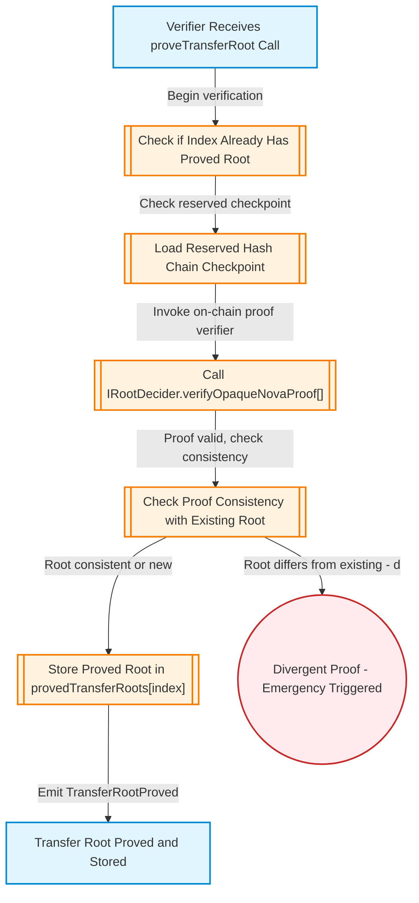
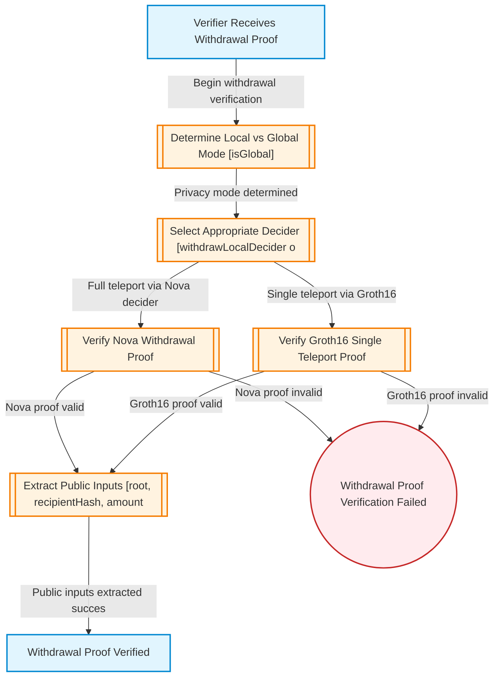
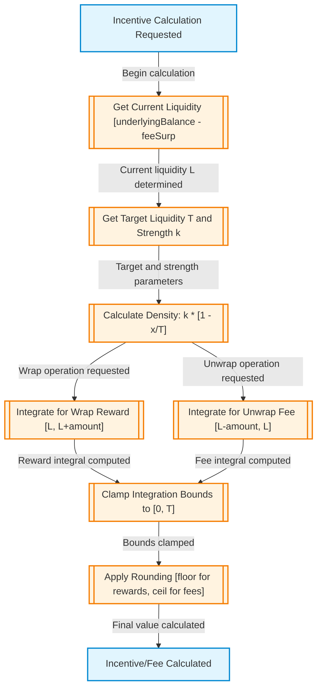
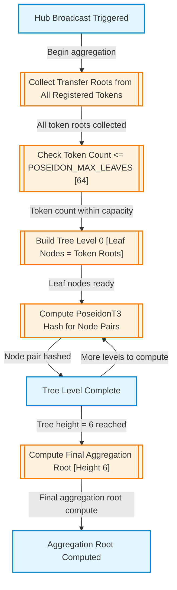
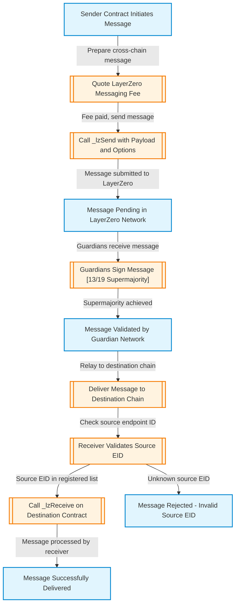
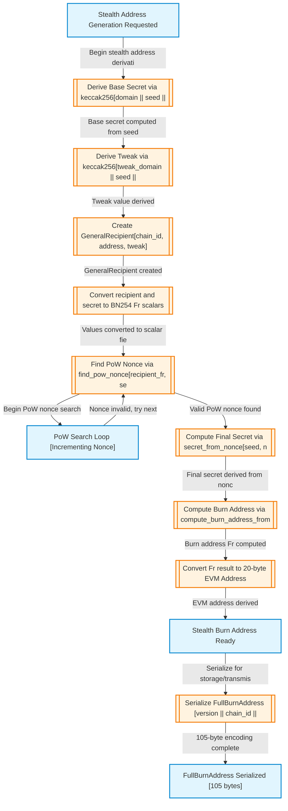
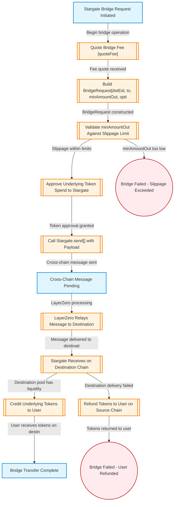

# zERC20 プライバシートークンプロトコル 監査事前提示文書

**作成日**: 2026年1月11日  

---

## 目次

1. [はじめに](#1-はじめに)
2. [プロトコル仕様](#2-プロトコル仕様)
   - 2.1 概要
   - 2.2 主要な登場人物
   - 2.3 主要なデータ構造
3. [トラストモデル](#3-トラストモデル)
   - 3.1 信頼レベル定義
   - 3.2 コンポーネント分類
   - 3.3 信頼境界エッジ
   - 3.4 監査範囲
   - 3.5 重大度定義
4. [メインプログラムグラフ](#4-メインプログラムグラフ)
5. [サブグラフ別プロパティとチェックリスト](#5-サブグラフ別プロパティとチェックリスト)
6. [境界セキュリティチェックリスト](#6-境界セキュリティチェックリスト)
7. [プロパティカテゴリ別サマリ](#7-プロパティカテゴリ別サマリ)
8. [結論とフィードバック依頼](#8-結論とフィードバック依頼)

---

## 1. はじめに

本文書は、**zERC20プライバシートークンプロトコル**のセキュリティ監査を開始するにあたり、監査対象となるシステムの仕様、信頼モデル（トラストモデル）、および監査の焦点となるプロパティとチェックリストを事前提示し、関係者間の認識を統一することを目的とします。

---

## 2. プロトコル仕様

### 2.1 概要

| 項目 | 内容 |
|:---|:---|
| **プロトコル名** | zERC20 Privacy Token Protocol |
| **キーワード** | zkSNARKs, zkWormhole, zERC20 |

> 本プロトコルは、Nova folding schemesとGroth16証明を使用してプライベートなERC20転送を実現するマルチチェーンプライバシートークンプロトコルです。LayerZero v2を介したクロスチェーン連携により、複数のEVMチェーン間でのプライバシー保護された資産移動を可能にします。

### 2.2 主要な登場人物 (Trusted Entities)

本プロトコルには16のエンティティが定義されています。

| ID | エンティティ名 | 説明 |
|:---|:---|:---|
| `ACTOR-USER` | End User | CLI/dAppを介してwrap、unwrap、transfer、private teleportを実行する外部ユーザー |
| `ACTOR-ZERC20-CONTRACT` | zERC20 Token Contract | BN254スカラーフィールド互換性のためvalue <= 2^248-1を強制するアップグレード可能なERC-20実装。SHA-256ハッシュチェーンで転送履歴を維持 |
| `ACTOR-VERIFIER-CONTRACT` | Verifier Contract | Nova/Groth16証明検証とクロスチェーン連携を管理するLayerZero OApp |
| `ACTOR-HUB-CONTRACT` | Hub Contract | トークンごとの転送ルートと単調増加ツリーインデックスを追跡する中央集約ポイント |
| `ACTOR-LIQUIDITY-MANAGER` | LiquidityManager Contract | zERC20のmint/burnの唯一の権限。インセンティブカーブによるwrap報酬とunwrap手数料を実装 |
| `ACTOR-ADAPTOR-CONTRACT` | Adaptor Contract | Stargateブリッジを使用したクロスチェーン出口調整。lzComposeコールバックを実装 |
| `ACTOR-CONTRACT-OWNER` | Contract Owner/Protocol Admin | onlyOwnerアクセスを持つ特権EOAまたはマルチシグ。タイムロックなしで即時効果 |
| `ACTOR-INDEXER-SERVICE` | Indexer Service | zERC20転送イベントをインデックス化し、Merkle証明を生成するオフチェーンサービス |
| `ACTOR-DECIDER-PROVER-SERVICE` | Decider/Prover Service | Nova IVC証明をGroth16最終証明に変換するオフチェーンサービス |
| `ACTOR-LAYERZERO-NETWORK` | LayerZero v2 Network | HubとVerifierコントラクト間の信頼性の高いメッセージパッシングを可能にするクロスチェーンメッセージングプロトコル |
| `ACTOR-STARGATE-BRIDGE` | Stargate Bridge | 双方向資産転送を可能にするクロスチェーン流動性ブリッジ |
| `ACTOR-IC-KEY-MANAGER` | IC Key Manager Canister | ステルスアドレスシークレットを管理するInternet Computerキャニスター |
| `ACTOR-IC-STORAGE` | IC Storage Canister | 暗号化された状態ストレージを提供するInternet Computerキャニスター |
| `ACTOR-POSEIDON-CIRCUIT` | Poseidon Hash Circuit | circom互換設定のlight-poseidonライブラリを使用したZKフレンドリーハッシュ関数 |
| `ACTOR-BABYJUBJUB-CIRCUIT` | Baby JubJub Curve Operations | BN254に埋め込まれたBaby JubJub曲線上の楕円曲線演算 |
| `ACTOR-NOVA-CIRCUIT` | Nova Folding Circuit | sonobe/folding-schemesライブラリを使用した増分検証可能計算回路 |

### 2.3 主要なデータ構造

本プロトコルには33のデータ構造が定義されています。以下に主要なものを示します。

| ID | データ構造名 | 説明 |
|:---|:---|:---|
| `DATA-ZERC20-TOKEN` | zERC20 Token | BN254フィールド互換性のためvalue <= 2^248-1に制約されたプライバシー対応ERC20トークン |
| `DATA-HASH-CHAIN` | SHA-256 Hash Chain | 各転送で(to, value)を追加する248ビット切り捨てSHA-256ハッシュチェーン |
| `DATA-INDEXED-TRANSFER-EVENT` | IndexedTransfer Event | index、from、to、valueを含む各転送で発行されるイベント |
| `DATA-TRANSFER-ROOT` | Transfer Root | 指定インデックスでのインデックス付き転送のMerkleルート |
| `DATA-GLOBAL-TRANSFER-ROOT` | Global Transfer Root | チェーン間のすべての登録トークンの転送ルートを組み合わせたHub集約ルート |
| `DATA-AGGREGATION-ROOT` | PoseidonT3 Aggregation Root | 最大64のトークン転送ルートを集約する高さ6のPoseidonツリーのルート |
| `DATA-NOVA-IVC-PROOF` | Nova IVC Proof | Nova folding schemeで生成された増分検証可能計算証明 |
| `DATA-GROTH16-PROOF` | Groth16 Final Proof | Nova IVC証明から生成された簡潔なzkSNARK証明 |
| `DATA-GENERAL-RECIPIENT` | GeneralRecipient | chain_id、address、tweakとバージョンバイトを含むエンコードされた受信者構造 |
| `DATA-STEALTH-ADDRESS` | Stealth Burn Address | compute_burn_address_from_secret()を使用して計算された派生アドレス |
| `DATA-HISTORICAL-PROOF` | Historical Merkle Proof | target_index、leaf_index、root、hash_chain、siblings[]を含む証明構造 |
| `DATA-INCENTIVE-CURVE-PARAMS` | Incentive Curve Parameters | 線形密度曲線パラメータ: k（ベーシスポイント強度）、T（目標流動性） |
| `DATA-TELEPORT-REQUEST` | Teleport Request | zkSNARK証明を含むプライバシー保護転送リクエスト |
| `DATA-RESERVED-HASH-CHAIN` | Reserved Hash Chain Checkpoint | 予約時のzERC20状態のスナップショット |
| `DATA-LAYERZERO-MESSAGE` | LayerZero Cross-Chain Message | Hub-Verifier通信用のメッセージ構造 |

---

## 3. トラストモデル

### 3.1 信頼レベル定義

| 信頼レベル | 説明 |
|:---|:---|
| **TRUSTED** | 完全に信頼。侵害は監査範囲外。正しく動作すると仮定 |
| **IN_SCOPE** | 監査対象。実装の正当性を検証する必要がある。コントラクト間呼び出しはここに該当 |
| **SEMI_TRUSTED** | 部分的に信頼。検証/確認が必要だが、悪意があるとは仮定しない。外部依存関係 |
| **UNTRUSTED** | 信頼しない。潜在的に悪意があると仮定。すべての入力を検証する必要がある |

### 3.2 コンポーネント分類

*図1: zERC20プロトコルのトラストバウンダリ概要*

#### オンチェーンコンポーネント（IN_SCOPE）

| コンポーネント | 説明 | 主要なロール |
|:---|:---|:---|
| **Verifier Contract** | Nova/Groth16証明検証とクロスチェーン連携を管理 | CALLER_USER: UNTRUSTED, CALLER_LAYERZERO: SEMI_TRUSTED |
| **zERC20 Token Contract** | value制約とハッシュチェーン整合性を持つコアトークンコントラクト | CALLER_USER: UNTRUSTED, CALLER_LIQUIDITY_MANAGER: IN_SCOPE |
| **LiquidityManager Contract** | インセンティブカーブ強制によるmint/burnの唯一の権限 | CALLER_USER: UNTRUSTED |
| **Hub Contract** | PoseidonT3ツリー計算とLayerZeroメッセージ処理を持つ中央集約ポイント | CALLER_LAYERZERO: SEMI_TRUSTED, CALLER_USER: UNTRUSTED |
| **Adaptor Contract** | スリッページ保護を持つクロスチェーン出口調整 | CALLER_USER: UNTRUSTED, CALLER_STARGATE: SEMI_TRUSTED |

#### オフチェーンコンポーネント（SEMI_TRUSTED）

| コンポーネント | 説明 | セキュリティノート |
|:---|:---|:---|
| **Prover/Decider Service** | Nova IVC証明をGroth16証明に変換 | ZKP soundnessにより、証明のシリアライゼーションやマレアビリティはセキュリティ上の懸念ではない |
| **Indexer Service** | インデックス化されたオンチェーンイベントからMerkle証明を提供 | 提供されたデータは最終的にオンチェーンで検証される |
| **Cross-Chain Job** | Verifier状態を監視しブロードキャストをトリガー | isUpToDateはオンチェーンで参照すべきではない |
| **IC Key Manager Canister** | ステルスアドレスシークレットを管理 | Internet Computerインフラ運用 |
| **IC Storage Canister** | 暗号化された状態ストレージを提供 | Internet Computerインフラ運用 |

#### 外部依存関係（SEMI_TRUSTED）

| 依存関係 | 説明 | 検証要件 |
|:---|:---|
| **LayerZero v2 Network** | 13/19ガーディアンスーパーマジョリティを持つ外部クロスチェーンメッセージングインフラ | ソースEIDを登録ピアリストに対して検証する必要がある |
| **Stargate Bridge** | 外部クロスチェーン流動性ブリッジ | minAmountOutスリッページ制限を強制する必要がある |

### 3.3 信頼境界エッジ

本プロトコルには20の信頼境界エッジが定義されています。以下に**クリティカル**なものを示します。

| エッジID | 説明 | 検証要件 | クリティカル |
|:---|:---|:---|:---:|
| `EDGE-USER-SUBMITS-TELEPORT` | 信頼されないユーザーがGroth16証明を含むテレポートリクエストをVerifierに送信 | Groth16証明を完全に検証、転送ルートの存在を確認、受信者バインディングを検証、単調増加totalTeleportedを強制 | **Yes** |
| `EDGE-LAYERZERO-TO-HUB` | LayerZeroがクロスチェーンメッセージをHubに配信 | ペイロードを受け入れる前に、ソースEIDを登録Verifierリストに対して検証 | **Yes** |
| `EDGE-LAYERZERO-TO-VERIFIER` | LayerZeroがHubからVerifierにグローバルルートを配信 | グローバルルートを保存する前に、ソースEIDが認可されたHubであることを検証 | **Yes** |
| `EDGE-STARGATE-TO-ADAPTOR` | Stargateブリッジがクロスチェーントークン転送完了後にAdaptorでlzComposeコールバックを呼び出し | 送信者が認可されたStargateエンドポイントであることを検証。amountReceivedLDがminAmountOutスリッページ制限を満たすことを確認 | **Yes** |
| `EDGE-VERIFIER-TO-ZERC20-TELEPORT` | VerifierがZKP検証成功後にzERC20でteleportを呼び出してトークンをmint | zERC20.teleport()はmsg.sender == verifier()を検証する必要がある。これはLiquidityManagerとは別の特権mintingパスウェイ | **Yes** |

#### クリティカル境界サマリ

| 境界タイプ | 説明 | 検証原則 |
|:---|:---|:---|
| **USER_TO_CONTRACT** | プロトコルコントラクトとのすべてのユーザーインタラクション | すべてのユーザー入力は、状態変更前に暗号学的に検証またはバウンドチェックされる必要がある |
| **CROSS_CHAIN_MESSAGING** | HubとVerifierコントラクト間のLayerZeroメッセージパッシング | ソースエンドポイントID（EID）は、メッセージペイロードを受け入れる前に登録ピアリストに対して検証される必要がある |
| **OFF_CHAIN_OUTPUT** | オンチェーンで使用されるオフチェーンサービスからのデータ | すべてのオフチェーンデータはオンチェーンで暗号学的に検証される（ZK証明、Merkle証明） |
| **INTER_CONTRACT** | 両方のmintingパスウェイを含むプロトコルコントラクト間の呼び出し | 呼び出し元認可を検証する必要がある。両方のパスウェイがzERC20をmintできる - 二重カウントやバイパスがないことを確認 |
| **OWNER_PRIVILEGED** | 信頼されたオーナーによる管理操作 | オーナー侵害は範囲外。タイムロックなし。補償コントロールが必要（マルチシグ、監視） |
| **EXTERNAL_BRIDGE** | Stargateを介した双方向クロスチェーン資産ブリッジング | アウトバウンド: スリッページ制限が保護。インバウンド: 送信者エンドポイントを検証、受信額を確認、リファンドを正しく処理 |

### 3.4 監査範囲

#### 監査対象（In Scope）

- コントラクトロジックバグ
- ZKP soundness検証
- 入力検証
- 状態管理
- コントラクト間呼び出しの正当性
- 信頼境界越え検証

#### 監査対象外（Out of Scope）

| 項目 | 説明 |
|:---|:---|
| **DEPLOYMENT_AND_OWNER_PRIVILEGES** | デプロイ時パラメータの操作またはコントラクトオーナー権限を必要とする脆弱性 |
| **TRUSTED_SETUP** | 回路のtrusted setupに関連する攻撃。現在の実装は開発/テスト用に固定シードを使用 |
| **VOLUME_BASED_DOS** | 大量の転送を発行することのみで達成されるDoS |
| **SELF_INFLICTED_ATTACKS** | 攻撃者自身のみに影響するバグ |
| **RECOVERABLE_CROSS_CHAIN_GRIEFING** | 不十分なガスによる意図的に失敗するクロスチェーンメッセージの送信 |

#### 監査対象外の例外

| 項目 | 発見時の重大度 |
|:---|:---|
| **EXPENSIVE_RETRY_CROSS_CHAIN_ATTACK** | リトライコストが直接実行コストを超えるクロスチェーンメッセージング攻撃 | HIGH |
| **IRRECOVERABLE_CROSS_CHAIN_STATE** | リトライ不可能または回復不可能な状態を作成するクロスチェーンメッセージング攻撃 | CRITICAL |

### 3.5 重大度定義

| レベル | 説明 | 例 |
|:---|:---|:---|
| **CRITICAL** | ZKP soundnessの欠如；資産盗難、永久的な資産ロック、またはシステム障害につながる可能性 | ZKP回路soundness脆弱性、totalTeleportedバイパスによる二重支出、無限トークンインフレーションにつながる不正mint |
| **HIGH** | 機密性侵害；システムを停止できる低コストで実行しやすい攻撃；一時的な資産ロック | ユーザートランザクションリンク可能性を露出するプライバシーリーク、低コストでクロスチェーンメッセージングを停止するDoS攻撃 |
| **MEDIUM** | 特定の前提条件または限定的なシナリオでのみ悪用可能；90ビット以下の有効セキュリティレベル | 特定のコントラクト状態またはタイミングを必要とする攻撃、90ビット以下のセキュリティを持つ暗号学的弱点 |
| **LOW** | 安全性への直接的な影響は少ないが、運用上の誤用を誘発、将来の複合障害の種をまく、または可用性/コストを低下させる可能性 | 経済的グリーフィングを可能にするガス非効率、オフチェーン監視を妨げる欠落イベント発行 |
| **INFORMATIONAL** | ZKP/コントラクトベストプラクティスからの逸脱または軽微な設計上の欠点；リスクは間接的 | コードスタイルの不一致、欠落NatSpecドキュメント、冗長なストレージ読み取り |

---

## 4. メインプログラムグラフ

メインプログラムグラフ（`GRAPH-ZERC20-MAIN`）は、zERC20プロトコルの主要なフローを表現しています。

| 項目 | 値 |
|:---|:---|
| **グラフID** | GRAPH-ZERC20-MAIN |
| **タイトル** | zERC20 Privacy Token Protocol - Main Flow |
| **ノード数** | 70 |
| **エッジ数** | 83 |

メイングラフは以下の主要なフローを含みます：

1. **Wrap Flow**: ユーザーが基礎トークンをzERC20にラップ
2. **Unwrap Flow**: ユーザーがzERC20を基礎トークンにアンラップ
3. **Transfer Flow**: zERC20の標準転送とハッシュチェーン更新
4. **Teleport Flow**: ZKP検証を伴うプライバシー保護転送
5. **Cross-Chain Flow**: LayerZeroを介したHub-Verifier間の通信
6. **Bridge Flow**: Stargateを介したクロスチェーン資産移動

---

## 5. サブグラフ別プロパティとチェックリスト

本プロトコルには17のサブグラフが定義されています。各サブグラフに対して、関連するプロパティとチェックリストを以下に示します。

### 5.1 Nova IVC Proof Generation (Client-Side)

| 項目 | 値 |
|:---|:---|
| **グラフID** | GRAPH-NOVA-PROOF-GENERATION |
| **ノード数** | 8 |
| **エッジ数** | 8 |

クライアントサイドでのNova IVC証明生成フローを表現します。ユーザーがIndexerからMerkle証明を取得し、Nova folding stepを実行して最終的なIVC証明を生成します。

### 5.2 Nova to Groth16 Conversion (Decider/Prover Service)

*図2: Nova to Groth16 Conversion フロー*

| 項目 | 値 |
|:---|:---|
| **グラフID** | GRAPH-NOVA-TO-GROTH16 |
| **ノード数** | 8 |
| **エッジ数** | 7 |

Decider/Prover ServiceがNova IVC証明をGroth16証明に変換するフローを表現します。

### 5.3 Nova Transfer Root Proof Verification (On-Chain)

*図3: Nova Transfer Root Proof Verification フロー*

| 項目 | 値 |
|:---|:---|
| **グラフID** | GRAPH-NOVA-PROOF-VERIFICATION |
| **ノード数** | 8 |
| **エッジ数** | 7 |

オンチェーンでの転送ルート証明検証フローを表現します。

#### 関連プロパティ

| ID | プロパティ | カテゴリ |
|:---|:---|:---|
| `PROP-NODE-VERIFY-ROOT-INIT` | Verifierがprove TransferRoot呼び出しを受信した時点で、証明データの整合性チェックが開始される | STATE_INVARIANT |
| `PROP-NODE-VERIFY-CALL-ROOT-DECIDER` | IRootDecider.verifyOpaqueNovaProof()の呼び出しは、証明が数学的に正しい場合にのみtrueを返す | SOUNDNESS |
| `PROP-NODE-VERIFY-CHECK-PROOF-CONSISTENCY` | 同じインデックスに対して異なるルートが証明された場合、緊急状態がトリガーされる | INTEGRITY |

### 5.4 Withdrawal Proof Verification (Nova or Groth16)

*図4: Withdrawal Proof Verification フロー*

| 項目 | 値 |
|:---|:---|
| **グラフID** | GRAPH-WITHDRAWAL-PROOF-VERIFICATION |
| **ノード数** | 8 |
| **エッジ数** | 9 |

引き出し証明（NovaまたはGroth16）の検証フローを表現します。

#### 関連プロパティ

| ID | プロパティ | カテゴリ |
|:---|:---|:---|
| `PROP-WITHDRAWAL-SOUNDNESS` | 有効な引き出し証明なしにトークンをmintすることは不可能 | SOUNDNESS |
| `PROP-WITHDRAWAL-MONOTONICITY` | totalTeleportedは厳密に増加し、減少することはない | MONOTONICITY |
| `PROP-WITHDRAWAL-RECIPIENT-BINDING` | 証明内の受信者ハッシュは、実際のmint受信者にバインドされている | INTEGRITY |

### 5.5 Incentive Curve Calculation (IncentiveLib)

*図5: Incentive Curve Calculation フロー*

| 項目 | 値 |
|:---|:---|
| **グラフID** | GRAPH-INCENTIVE-CURVE |
| **ノード数** | 9 |
| **エッジ数** | 9 |

IncentiveLibによるインセンティブカーブ計算フローを表現します。

#### 関連プロパティ

| ID | プロパティ | カテゴリ |
|:---|:---|:---|
| `PROP-INCENTIVE-FLOOR-REWARD` | 報酬計算はfloor divisionを使用し、プロトコルが過払いしないことを保証 | INTEGRITY |
| `PROP-INCENTIVE-CEILING-FEE` | 手数料計算はceiling divisionを使用し、プロトコルが手数料を過少収集しないことを保証 | INTEGRITY |
| `PROP-INCENTIVE-BOUNDS` | 計算された報酬/手数料は常に[0, amount]の範囲内 | STATE_INVARIANT |

### 5.6 Hub PoseidonT3 Aggregation Tree Computation

*図6: Hub PoseidonT3 Aggregation Tree Computation フロー*

| 項目 | 値 |
|:---|:---|
| **グラフID** | GRAPH-HUB-AGGREGATION |
| **ノード数** | 8 |
| **エッジ数** | 8 |

HubでのPoseidonT3集約ツリー計算フローを表現します。

#### 関連プロパティ

| ID | プロパティ | カテゴリ |
|:---|:---|:---|
| `PROP-HUB-AGGREGATION-DETERMINISM` | 同じ入力に対して、集約ルート計算は常に同じ結果を生成 | INTEGRITY |
| `PROP-HUB-AGGSEQ-MONOTONICITY` | aggSeqカウンターは厳密に増加し、リセットされない | MONOTONICITY |

### 5.7 LayerZero v2 Cross-Chain Message Flow

*図7: LayerZero v2 Cross-Chain Message Flow*

| 項目 | 値 |
|:---|:---|
| **グラフID** | GRAPH-LAYERZERO-MESSAGE-FLOW |
| **ノード数** | 11 |
| **エッジ数** | 10 |

LayerZero v2を介したクロスチェーンメッセージフローを表現します。

#### 関連プロパティ

| ID | プロパティ | カテゴリ |
|:---|:---|:---|
| `PROP-LZ-PEER-VALIDATION` | _lzReceiveは、ソースEIDが登録ピアリストにない場合、メッセージを拒否する | BOUNDARY_SECURITY |
| `PROP-LZ-MESSAGE-INTEGRITY` | LayerZeroメッセージのペイロードは、送信から受信まで改ざんされない | INTEGRITY |

### 5.8 Stealth Burn Address Generation with PoW

*図8: Stealth Burn Address Generation with PoW フロー*

| 項目 | 値 |
|:---|:---|
| **グラフID** | GRAPH-STEALTH-ADDRESS-GENERATION |
| **ノード数** | 13 |
| **エッジ数** | 13 |

Proof-of-Workを伴うステルスバーンアドレス生成フローを表現します。

#### 関連プロパティ

| ID | プロパティ | カテゴリ |
|:---|:---|:---|
| `PROP-STEALTH-POW-VALIDITY` | PoW検証は、有効なnonceを持つアドレスのみを受け入れる | SOUNDNESS |
| `PROP-STEALTH-ADDRESS-DERIVATION` | ステルスアドレスは、シークレットから決定論的に派生する | INTEGRITY |

### 5.9 Stargate Bridge Detailed Flow

*図9: Stargate Bridge Detailed Flow*

| 項目 | 値 |
|:---|:---|
| **グラフID** | GRAPH-STARGATE-BRIDGE-FLOW |
| **ノード数** | 14 |
| **エッジ数** | 13 |

Stargateブリッジの詳細フローを表現します。

#### 関連プロパティ

| ID | プロパティ | カテゴリ |
|:---|:---|:---|
| `PROP-STARGATE-SLIPPAGE-PROTECTION` | minAmountOutスリッページ制限が強制され、ユーザーは予想より少ない額を受け取らない | INTEGRITY |
| `PROP-STARGATE-REFUND-HANDLING` | スリッページ超過時、リファンドアドレスに正しく返金される | INTEGRITY |

### 5.10 Stargate lzCompose Callback Processing

| 項目 | 値 |
|:---|:---|
| **グラフID** | GRAPH-STARGATE-LZCOMPOSE-CALLBACK |
| **ノード数** | 14 |
| **エッジ数** | 13 |

StargateからのlzComposeコールバック処理フローを表現します。

#### 関連プロパティ

| ID | プロパティ | カテゴリ |
|:---|:---|:---|
| `PROP-LZCOMPOSE-SENDER-VALIDATION` | lzComposeは、送信者が認可されたStargateエンドポイントであることを検証 | BOUNDARY_SECURITY |
| `PROP-LZCOMPOSE-REENTRANCY-PROTECTION` | lzComposeコールバックはリエントランシー攻撃から保護されている | TRANSITION_SECURITY |

### 5.11 Poseidon Hash Circuit Implementation

| 項目 | 値 |
|:---|:---|
| **グラフID** | GRAPH-POSEIDON-HASH-CIRCUIT |
| **ノード数** | 9 |
| **エッジ数** | 10 |

Poseidonハッシュ関数のZK回路実装フローを表現します。light-poseidonライブラリを使用し、circom互換の設定（PoseidonT2およびPoseidonT3）でハッシュ計算を行います。

#### 関連プロパティ

| ID | プロパティ | カテゴリ |
|:---|:---|:---|
| `PROP-POSEIDON-CIRCOM-COMPATIBILITY` | PoseidonハッシュパラメータはcircomとRust実装間で一致する | INTEGRITY |
| `PROP-POSEIDON-SPONGE-SECURITY` | Poseidonスポンジ構造は暗号学的セキュリティを維持する | SOUNDNESS |

### 5.12 Baby JubJub Elliptic Curve Operations

| 項目 | 値 |
|:---|:---|
| **グラフID** | GRAPH-BABY-JUBJUB-OPERATIONS |
| **ノード数** | 10 |
| **エッジ数** | 11 |

BN254に埋め込まれたBaby JubJub曲線上の楕円曲線演算フローを表現します。スカラー乗算、ポイント加算、公開鍵導出などの操作を含みます。

#### 関連プロパティ

| ID | プロパティ | カテゴリ |
|:---|:---|:---|
| `PROP-BJJ-POINT-VALIDATION` | すべての入力ポイントは曲線上にあることが検証される | INTEGRITY |
| `PROP-BJJ-SCALAR-MUL-CORRECTNESS` | スカラー乗算は数学的に正しい結果を生成する | SOUNDNESS |

### 5.13 Internet Computer Canister Interactions

| 項目 | 値 |
|:---|:---|
| **グラフID** | GRAPH-IC-CANISTER-INTERACTION |
| **ノード数** | 12 |
| **エッジ数** | 12 |

Internet Computer（IC）キャニスターとのインタラクションフローを表現します。VetKeyを使用した暗号鍵導出、AES-GCMによる状態暗号化、ICストレージキャニスターでの永続化を含みます。

#### 関連プロパティ

| ID | プロパティ | カテゴリ |
|:---|:---|:---|
| `PROP-IC-VETKEY-DERIVATION` | VetKeyから導出された暗号鍵はユーザー固有である | DATA_PROTECTION |
| `PROP-IC-STORAGE-ENCRYPTION` | ICストレージに保存されるすべての状態はAES-GCMで暗号化される | DATA_PROTECTION |

### 5.14 Nova Folding Scheme Internal Operations

| 項目 | 値 |
|:---|:---|
| **グラフID** | GRAPH-NOVA-FOLDING-SCHEME |
| **ノード数** | 16 |
| **エッジ数** | 15 |

Nova folding schemeの内部操作フローを表現します。IVC状態ベクトルの初期化、外部入力の受信、ステップ回路の計算、Merkleパス検証、アキュムレータ更新、インスタンスのフォールディングを含みます。

#### 関連プロパティ

| ID | プロパティ | カテゴリ |
|:---|:---|:---|
| `PROP-NOVA-IVC-SOUNDNESS` | Nova IVC証明は、すべての中間ステップが正しく実行された場合にのみ検証可能 | SOUNDNESS |
| `PROP-NOVA-ACCUMULATOR-INTEGRITY` | フォールディング後のアキュムレータは正しい累積状態を反映する | INTEGRITY |
| `PROP-NOVA-MERKLE-VERIFICATION` | 各フォールディングステップでMerkleパスが検証される | INTEGRITY |

### 5.15 SelfCall Utility Pattern for Reentrancy Prevention

| 項目 | 値 |
|:---|:---|
| **グラフID** | GRAPH-SELFCALL-PATTERN |
| **ノード数** | 9 |
| **エッジ数** | 8 |

外部リエントランシーを防止しながら内部状態遷移を許可するSelfCallパターンのフローを表現します。enableSelfCall()でコンテキストフラグを設定し、onlySelfCallモディファイアで保護された関数への自己呼び出しを可能にします。

#### 関連プロパティ

| ID | プロパティ | カテゴリ |
|:---|:---|:---|
| `PROP-SELFCALL-REENTRANCY-PREVENTION` | 外部呼び出し元はonlySelfCall保護関数を直接呼び出せない | TRANSITION_SECURITY |
| `PROP-SELFCALL-CONTEXT-ISOLATION` | SelfCallフラグは単一トランザクション内で一時的 | STATE_INVARIANT |

### 5.16 Native Token (ETH) Processing Flow

| 項目 | 値 |
|:---|:---|
| **グラフID** | GRAPH-NATIVE-TOKEN-HANDLING |
| **ノード数** | 9 |
| **エッジ数** | 8 |

LiquidityManagerでのネイティブETH処理フローを表現します。receive()関数、msg.value処理、ETH/WETHラッピング、余剰ETHの返金を含みます。

#### 関連プロパティ

| ID | プロパティ | カテゴリ |
|:---|:---|:---|
| `PROP-ETH-MSG-VALUE-VALIDATION` | msg.valueは期待される金額と一致する必要がある | INTEGRITY |
| `PROP-ETH-REFUND-SAFETY` | ETH返金はリエントランシーガードを使用する | TRANSITION_SECURITY |

### 5.17 Governance and Administrative Functions

| 項目 | 値 |
|:---|:---|
| **グラフID** | GRAPH-GOVERNANCE-ADMIN-FUNCTIONS |
| **ノード数** | 8 |
| **エッジ数** | 8 |

オーナー制限付きの管理機能フローを表現します。手数料パラメータ設定、報酬引き出し、Verifierローテーション、トークン登録、minter設定、コントラクトアップグレードを含みます。

#### 関連プロパティ

| ID | プロパティ | カテゴリ |
|:---|:---|:---|
| `PROP-ADMIN-ONLY-OWNER` | すべての管理関数はonlyOwnerモディファイアで保護される | AUTHORIZATION |
| `PROP-ADMIN-NO-TIMELOCK` | 管理操作はタイムロックなしで即時に効果を発揮する | STATE_INVARIANT |

#### セキュリティ考慮事項

| 項目 | 説明 |
|:---|:---|
| **タイムロックなし** | 管理操作は遅延なしで即時に効果を発揮 |
| **オーナー鍵リスク** | オーナー鍵の侵害はプロトコル完全制御を可能にする |
| **推奨事項** | 重要な操作にはタイムロックまたはマルチシグの実装を検討 |

---

## 6. 境界セキュリティチェックリスト

境界セキュリティに関する33のチェックリスト項目が定義されています。以下に主要なものを示します。

### 6.1 ユーザー入力検証

| ID | チェック項目 | バグクラス | 重大度ヒント |
|:---|:---|:---|:---|
| `CL-PROP-EDGE-001-USER-INITIATES-WRAP-01` | LiquidityManagerがwrap()関数エントリポイントですべてのユーザー提供wrap額を正しく検証することを確認 | Input Validation Bypass | High |
| `CL-PROP-EDGE-007-USER-INITIATES-UNWRAP-01` | LiquidityManagerがunwrap()関数エントリポイントですべてのユーザー提供unwrap額を正しく検証することを確認 | Input Validation Bypass | High |
| `CL-PROP-EDGE-014-USER-INITIATES-TRANSFER-01` | zERC20転送がvalue <= 2^248-1を信頼境界で正しく検証し、ZK回路互換性を維持することを確認 | Cryptographic Constraint Violation | Critical |

### 6.2 ZKP検証

| ID | チェック項目 | バグクラス | 重大度ヒント |
|:---|:---|:---|:---|
| `CL-PROP-EDGE-021-USER-SUBMITS-TELEPORT-01` | Verifierがテレポートリクエストでユーザー提供のGroth16証明を完全に検証することを確認 | ZKP Soundness Bypass | Critical |
| `CL-PROP-EDGE-021-USER-SUBMITS-TELEPORT-02` | totalTeleportedの単調増加が厳密に強制され、二重支出を防止することを確認 | Double Spend | Critical |

### 6.3 クロスチェーンメッセージング

| ID | チェック項目 | バグクラス | 重大度ヒント |
|:---|:---|:---|
| `CL-PROP-EDGE-028-LAYERZERO-TO-HUB-01` | Hubが_lzReceiveでソースEIDを登録Verifierリストに対して検証することを確認 | Cross-Chain Message Spoofing | Critical |
| `CL-PROP-EDGE-029-LAYERZERO-TO-VERIFIER-01` | Verifierがグローバルルートを保存する前にソースEIDが認可されたHubであることを検証することを確認 | Cross-Chain Message Spoofing | Critical |

### 6.4 Stargateコールバック

| ID | チェック項目 | バグクラス | 重大度ヒント |
|:---|:---|:---|
| `CL-PROP-EDGE-033-STARGATE-TO-ADAPTOR-01` | AdaptorがlzComposeで送信者が認可されたStargateエンドポイントであることを検証することを確認 | Unauthorized Callback | Critical |
| `CL-PROP-EDGE-033-STARGATE-TO-ADAPTOR-02` | amountReceivedLDがminAmountOutスリッページ制限を満たすことを検証し、リファンドロジックを正しく処理することを確認 | Slippage Bypass | High |

---

## 7. プロパティカテゴリ別サマリ

本プロトコルには132のプロパティが定義されており、以下の8カテゴリに分類されています。

| カテゴリ | 説明 | プロパティ数 |
|:---|:---|:---|
| **SOUNDNESS** | 暗号証明システムが偽造できないことを保証するプロパティ | 多数 |
| **INTEGRITY** | データが破損または操作されないことを保証するプロパティ | 多数 |
| **AUTHORIZATION** | 認可されたアクターのみがアクションを実行できることを保証するプロパティ | 多数 |
| **MONOTONICITY** | 値が必要に応じて増加または減少のみすることを保証するプロパティ | 多数 |
| **BOUNDARY_SECURITY** | 信頼境界が適切に強制されることを保証するプロパティ | 多数 |
| **STATE_INVARIANT** | 特定のプログラム状態で保持される必要があるプロパティ | 多数 |
| **TRANSITION_SECURITY** | 状態遷移中に保持される必要があるプロパティ | 多数 |
| **DATA_PROTECTION** | 転送中のデータの機密性と整合性を保証するプロパティ | 多数 |

### カバレッジサマリ

| 項目 | 値 |
|:---|:---|
| グラフ内の総ノード数 | 241 |
| グラフ内の総エッジ数 | 244 |
| 総境界エッジ数 | 20 |
| プロパティを持つノード数 | 241 |
| プロパティを持つエッジ数 | 244 |
| ノードカバレッジ | 100% |
| エッジカバレッジ | 100% |

---

## 8. 結論とフィードバック依頼

本文書では、zERC20プライバシートークンプロトコルの監査に先立ち、以下の内容を整理して提示しました。

1. **プロトコル仕様**: 16のエンティティ、33のデータ構造、メインプログラムグラフと17のサブグラフ
2. **トラストモデル**: 4段階の信頼レベル、5つのオンチェーンコンポーネント、5つのオフチェーンコンポーネント、2つの外部依存関係、20の信頼境界エッジ
3. **プロパティ**: 8カテゴリ、132のプロパティ（100%カバレッジ）
4. **チェックリスト**: 33の境界セキュリティチェックリスト、113のプロパティベースチェックリスト

本文書で提示した仕様、トラストモデル、プロパティ、およびチェックリストについて、貴社からのフィードバックをいただきたく存じます。特に以下の点についてご確認ください。

- 仕様の正確性と完全性
- トラストモデルの妥当性
- 監査範囲の適切性
- 追加で考慮すべきセキュリティ上の懸念

いただいたフィードバックを反映し、最終的な監査計画を策定いたします。

